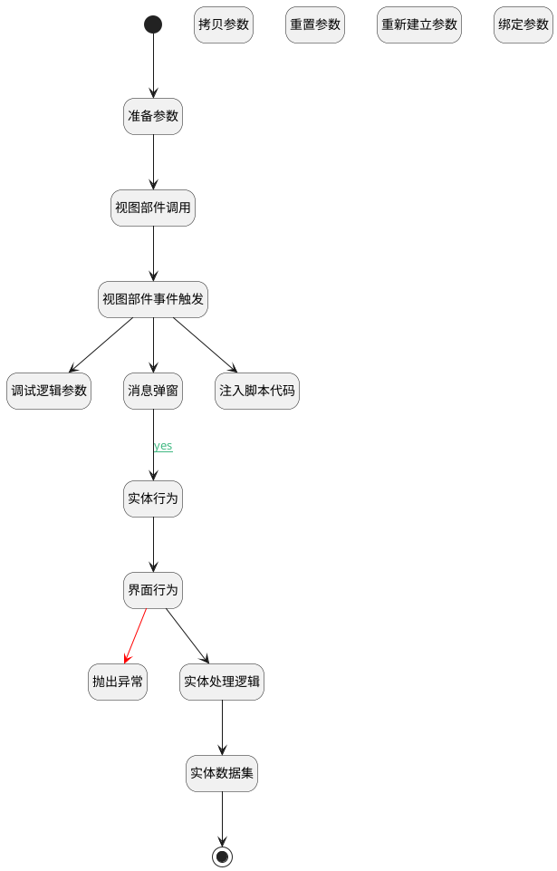

## x <!-- {docsify-ignore-all} -->

   不确定干嘛的，慎删

### 处理过程




### 处理步骤说明

#### 开始 :id=Begin


#### 调试逻辑参数 :id=DEBUGPARAM1


> [!NOTE|label:调试信息|icon:fa fa-bug]
> 调试输出参数`传入变量`的详细信息

#### 消息弹窗 :id=MSGBOX1


#### 拷贝参数 :id=COPYPARAM1


拷贝参数`ctrl` 到 `Default(传入变量)`

#### 重置参数 :id=RESETPARAM1


重置参数```Default(传入变量)```
#### 注入脚本代码 :id=RAWJSCODE1


<p class="panel-title"><b>执行代码</b></p>

```javascript
safsadfsdfasdfsdfsdf
```

#### 实体数据集 :id=DEDATASET1


#### 界面行为 :id=DEUIACTION1


调用实体 [用例步骤(STEP)](module/TestMgmt/Step.md) 界面行为 [建立数据](module/TestMgmt/Step#界面行为) ，行为参数为`view`

#### 重新建立参数 :id=RENEWPARAM1


重建参数
#### 抛出异常 :id=THROWEXCEPTION1


> [!ATTENTION|label:抛出异常|icon:fa fa-warning]
> 错误信息：业务属数据错误

#### 实体行为 :id=DEACTION1


调用实体 [需求(IDEA)](module/ProdMgmt/Idea.md) 行为 [Get](module/ProdMgmt/Idea#行为) ，行为参数为`Default(传入变量)`

#### 视图部件调用 :id=VIEWCTRLINVOKE1


调用`ctrl`的方法`fffa`，参数为`Default(传入变量)`
#### 视图部件事件触发 :id=VIEWCTRLFIREEVENT1


触发`view`的事件`change`
#### 绑定参数 :id=BINDPARAM1


绑定参数`Default(传入变量)` 到 `view`
#### 结束 :id=END1


#### 准备参数 :id=PREPAREJSPARAM1


1. 将`Default(传入变量)` 设置给  `Default(传入变量)`

#### 实体处理逻辑 :id=DELOGIC1


调用处理逻辑异常，请检查配置平台相关配置

### 连接条件说明
#### yes :id=MSGBOX1-DEACTION1

```view(view)``` EQ ```yes```


### 实体逻辑参数

|    中文名   |    代码名    |  数据类型      |备注 |
| --------| --------| --------  | --------   |
|传入变量(<i class="fa fa-check"/></i>)|Default|数据对象||
|filter|filter|过滤器||
|view|view|当前视图对象||
|page|page|分页查询||
|ctrl|ctrl|当前部件对象||
