## 获取项目进度 <!-- {docsify-ignore-all} -->

   

### 处理过程

```plantuml
@startuml
hide empty description
<style>
root {
  HyperlinkColor #42b983
}
</style>

hide empty description
state "开始" as Begin <<start>> [[$./get_schedule#begin {"开始"}]]
state "获取已完成数目" as RAWSQLCALL1  [[$./get_schedule#rawsqlcall1 {"获取已完成数目"}]]
state "获取全部数目" as RAWSQLCALL2  [[$./get_schedule#rawsqlcall2 {"获取全部数目"}]]
state "计算项目进度" as RAWSFCODE1  [[$./get_schedule#rawsfcode1 {"计算项目进度"}]]
state "结束" as END1 <<end>> [[$./get_schedule#end1 {"结束"}]]


Begin --> RAWSQLCALL1
RAWSQLCALL1 --> RAWSQLCALL2
RAWSQLCALL2 --> RAWSFCODE1
RAWSFCODE1 --> END1


@enduml
```




### 处理步骤说明

#### 开始 :id=Begin<sup class="footnote-symbol"> <font color=gray size=1>[开始]</font></sup>


*- N/A*
#### 获取已完成数目 :id=RAWSQLCALL1<sup class="footnote-symbol"> <font color=gray size=1>[直接SQL调用]</font></sup>


<p class="panel-title"><b>执行sql语句</b></p>

```sql
select count(1) as `dividend` from work_item where IS_DELETED = '0' and `STATE` = '40' and PROJECT_ID = ?
```

<p class="panel-title"><b>执行sql参数</b></p>

1. `Default(传入变量).ID(标识)`

重置参数`Default(传入变量)`，并将执行sql结果赋值给参数`Default(传入变量)`

#### 获取全部数目 :id=RAWSQLCALL2<sup class="footnote-symbol"> <font color=gray size=1>[直接SQL调用]</font></sup>


<p class="panel-title"><b>执行sql语句</b></p>

```sql
select count(1) as `divisor` from work_item where IS_DELETED = '0'  and PROJECT_ID = ?
```

<p class="panel-title"><b>执行sql参数</b></p>

1. `Default(传入变量).ID(标识)`

重置参数`Default(传入变量)`，并将执行sql结果赋值给参数`Default(传入变量)`

#### 计算项目进度 :id=RAWSFCODE1<sup class="footnote-symbol"> <font color=gray size=1>[直接后台代码]</font></sup>


<p class="panel-title"><b>执行代码[JavaScript]</b></p>

```groovy
var project = logic.getParam("Default");
var dividend = parseInt(project.get("dividend"));
var divisor = parseInt(project.get("divisor"));
if(dividend != 0 && divisor != 0){
    project.set("schedule",  Math.round((dividend / divisor) * 100));
}
```

#### 结束 :id=END1<sup class="footnote-symbol"> <font color=gray size=1>[结束]</font></sup>


返回 `Default(传入变量)`


### 实体逻辑参数

|    中文名   |    代码名    |  数据类型    |  实体   |备注 |
| --------| --------| -------- | -------- | --------   |
|传入变量(<i class="fa fa-check"/></i>)|Default|数据对象|[项目(PROJECT)](module/ProjMgmt/Project.md)||
