## 项目名称(PROJECT_NAME) <!-- {docsify-ignore-all} -->

   

### 默认规则 :id=Default

```plantuml
@startuml
hide empty description
<style>
root {
  HyperlinkColor #42b983
}
</style>

state "start" as start  <<start>>
state "end" as end <<end>>
state "默认字符串长度" as 2b44a08ed9efacb780619282d06fb304 [[$./Project_name#a2b44a08ed9efacb780619282d06fb304 {"默认字符串长度"}]]


start --> 2b44a08ed9efacb780619282d06fb304 
2b44a08ed9efacb780619282d06fb304 --> end 


@enduml
```

#### 条件说明

##### 默认字符串长度 :id=a2b44a08ed9efacb780619282d06fb304

*关键条件*

`PROJECT_NAME(项目名称)` 属性长度在区间 `(0 , 200]` 内

> [!ATTENTION|label:规则信息|icon:fa fa-warning]
> 内容长度必须小于等于[200]

