## 编辑类别或分组 <!-- {docsify-ignore-all} -->

   

### 处理过程

```plantuml
@startuml
hide footbox
<style>
root {
  HyperlinkColor #42b983
}
</style>

hide empty description
state "开始" as Begin <<start>> [[$./edit_section_or_category#begin {开始}]]
state "准备参数" as PREPAREJSPARAM1  [[$./edit_section_or_category#preparejsparam1 {准备参数}]]
state "视图部件调用" as VIEWCTRLINVOKE1  [[$./edit_section_or_category#viewctrlinvoke1 {视图部件调用}]]
state "调试逻辑参数" as DEBUGPARAM1  [[$./edit_section_or_category#debugparam1 {调试逻辑参数}]]


Begin --> DEBUGPARAM1
DEBUGPARAM1 --> PREPAREJSPARAM1
PREPAREJSPARAM1 --> VIEWCTRLINVOKE1


@enduml
```

### 处理步骤说明

#### 开始 :id=Begin

#### 准备参数 :id=PREPAREJSPARAM1

1. 将`Default(传入变量)._id` 设置给  `node_param(节点参数).nodeKey`

#### 视图部件调用 :id=VIEWCTRLINVOKE1

调用`treeexpbar_tree(树部件)`的方法`updateTreeNode`，参数为`node_param(节点参数)`
#### 调试逻辑参数 :id=DEBUGPARAM1

> [!NOTE|label:调试信息|icon:fa fa-bug]
> 调试输出参数`传入变量`的详细信息

### 实体逻辑参数

|    中文名   |    代码名    |  数据类型      |备注 |
| --------| --------| --------  | --------   |
|树部件|treeexpbar_tree|部件对象||
|节点参数|node_param|数据对象||
|传入变量(<i class="fa fa-check"/></i>)|Default|数据对象||
