## 分配负责人 <!-- {docsify-ignore-all} -->

   

### 处理过程

```plantuml
@startuml
hide empty description
<style>
root {
  HyperlinkColor #42b983
}
</style>

hide empty description
state "开始" as Begin <<start>> [[$./change_assignee#begin {"开始"}]]
state "绑定参数" as BINDPARAM1  [[$./change_assignee#bindparam1 {"绑定参数"}]]
state "循环子调用" as LOOPSUBCALL1  [[$./change_assignee#loopsubcall1 {"循环子调用"}]] #green {
state "准备参数" as PREPAREPARAM2  [[$./change_assignee#prepareparam2 {"准备参数"}]]
state "分配负责人" as DEACTION1  [[$./change_assignee#deaction1 {"分配负责人"}]]
}


Begin --> BINDPARAM1
BINDPARAM1 --> LOOPSUBCALL1
LOOPSUBCALL1 --> PREPAREPARAM2
PREPAREPARAM2 --> DEACTION1


@enduml
```

### 处理步骤说明

#### 开始 :id=Begin [开始]

*- N/A*
#### 绑定参数 :id=BINDPARAM1 [绑定参数]

绑定参数`Default(传入变量)` 到 `srfactionparam(选择数据对象)`
#### 准备参数 :id=PREPAREPARAM2 [准备参数]

1. 将`for_temp_obj(循环临时变量).ASSIGNEE_ID(负责人标识)` 设置给  `Default(传入变量).ASSIGNEE_ID(负责人标识)`
2. 将`for_temp_obj(循环临时变量).ASSIGNEE_NAME(负责人)` 设置给  `Default(传入变量).ASSIGNEE_NAME(负责人)`

#### 分配负责人 :id=DEACTION1 [实体行为]

调用实体 [工作项(WORK_ITEM)](module/ProjMgmt/Work_item.md) 行为 [Update](module/ProjMgmt/Work_item#行为) ，行为参数为`Default(传入变量)`

#### 循环子调用 :id=LOOPSUBCALL1 [循环子调用]

循环参数`srfactionparam(选择数据对象)`，子循环参数使用`for_temp_obj(循环临时变量)`

### 实体逻辑参数

|    中文名   |    代码名    |  数据类型    |  实体   |备注 |
| --------| --------| -------- | -------- | --------   |
|传入变量(<i class="fa fa-check"/></i>)|Default|数据对象|[工作项(WORK_ITEM)](module/ProjMgmt/Work_item.md)||
|循环临时变量|for_temp_obj|数据对象|[工作项(WORK_ITEM)](module/ProjMgmt/Work_item.md)||
|选择数据对象|srfactionparam|数据对象列表|[工作项(WORK_ITEM)](module/ProjMgmt/Work_item.md)||
