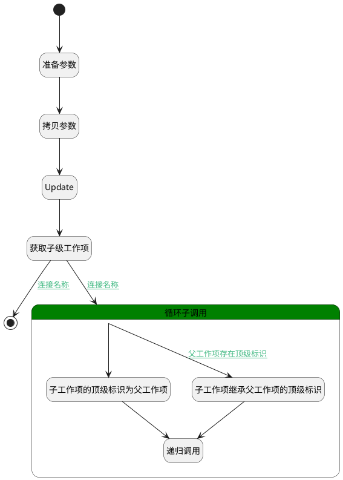

## 变更顶级工作项 <!-- {docsify-ignore-all} -->

   

### 处理过程

### 处理步骤说明

#### 开始 :id=Begin [开始]

*- N/A*
#### 准备参数 :id=PREPAREPARAM1 [准备参数]

1. 将`Default(传入变量).ID(标识)` 设置给  `filter(过滤器).n_pid_eq`

#### 拷贝参数 :id=COPYPARAM1 [拷贝参数]

拷贝参数`Default(传入变量)` 到 `parent_item(父工作项)`

#### 子工作项继承父工作项的顶级标识 :id=PREPAREPARAM2 [准备参数]

1. 将`parent_item(父工作项).TOP_ID(顶级工作项标识)` 设置给  `for_temp(循环临时变量).TOP_ID(顶级工作项标识)`

#### Update :id=DEACTION1 [实体行为]

调用实体 [工作项(WORK_ITEM)](module/ProjMgmt/Work_item.md) 行为 [Update](module/ProjMgmt/Work_item#行为) ，行为参数为`Default(传入变量)`

将执行结果返回给参数`Default(传入变量)`

#### 获取子级工作项 :id=DEDATASET1 [实体数据集]

调用实体 [工作项(WORK_ITEM)](module/ProjMgmt/Work_item.md) 数据集合 [正常状态(normal)](module/ProjMgmt/Work_item#数据集合) ，查询参数为`filter(过滤器)`

将执行结果返回给参数`child_page(下级工作项列表)`

#### 循环子调用 :id=LOOPSUBCALL1 [循环子调用]

循环参数`child_page(下级工作项列表)`，子循环参数使用`for_temp(循环临时变量)`
#### 递归调用 :id=DELOGIC1 [实体逻辑]

调用实体 [工作项(WORK_ITEM)](module/ProjMgmt/Work_item.md) 处理逻辑 [变更顶级工作项]((module/ProjMgmt/Work_item/logic/change_top.md)) ，行为参数为`for_temp(循环临时变量)`

#### 子工作项的顶级标识为父工作项 :id=PREPAREPARAM3 [准备参数]

1. 将`parent_item(父工作项).ID(标识)` 设置给  `for_temp(循环临时变量).TOP_ID(顶级工作项标识)`

#### 结束 :id=END1 [结束]

*- N/A*

### 连接条件说明
#### 连接名称 :id=DEDATASET1-LOOPSUBCALL1

`child_page(下级工作项列表).size` GT `0`
#### 父工作项存在顶级标识 :id=LOOPSUBCALL1-PREPAREPARAM2

`parent_item(父工作项).TOP_ID(顶级工作项标识)` ISNOTNULL
#### 连接名称 :id=DEDATASET1-END1

`child_page(下级工作项列表).size` EQ `0`

### 实体逻辑参数

|    中文名   |    代码名    |  数据类型    |  实体   |备注 |
| --------| --------| -------- | -------- | --------   |
|传入变量(<i class="fa fa-check"/></i>)|Default|数据对象|[工作项(WORK_ITEM)](module/ProjMgmt/Work_item.md)||
|下级工作项列表|child_page|分页查询|||
|过滤器|filter|过滤器|||
|循环临时变量|for_temp|数据对象|[工作项(WORK_ITEM)](module/ProjMgmt/Work_item.md)||
|父工作项|parent_item|数据对象|[工作项(WORK_ITEM)](module/ProjMgmt/Work_item.md)||
