## 预计工时表单项更新 <!-- {docsify-ignore-all} -->

   

### 处理过程

```plantuml
@startuml
hide empty description
<style>
root {
  HyperlinkColor #42b983
}
</style>

hide empty description
state "开始" as Begin <<start>> [[$./estimated_updateform#begin {"开始"}]]
state "计算剩余工时和工时进度" as RAWSFCODE1  [[$./estimated_updateform#rawsfcode1 {"计算剩余工时和工时进度"}]]
state "结束" as END1 <<end>> [[$./estimated_updateform#end1 {"结束"}]]


Begin --> RAWSFCODE1
RAWSFCODE1 --> END1


@enduml
```




### 处理步骤说明

#### 开始 :id=Begin<sup class="footnote-symbol"> <font color=gray size=1>[开始]</font></sup>


*- N/A*
#### 计算剩余工时和工时进度 :id=RAWSFCODE1<sup class="footnote-symbol"> <font color=gray size=1>[直接后台代码]</font></sup>


<p class="panel-title"><b>执行代码[JavaScript]</b></p>

```groovy
var defaultObj = logic.getParam("default");
var estimated_workload = defaultObj.get("estimated_workload") == null ? 0 : defaultObj.get("estimated_workload");
var actual_workload = defaultObj.get("actual_workload") == null ? 0 : defaultObj.get("actual_workload");
var remaining_workload = (estimated_workload - actual_workload) > 0 ? (estimated_workload - actual_workload).toFixed(1) : 0;
defaultObj.set("remaining_workload", remaining_workload);
if((actual_workload + remaining_workload) > 0 && actual_workload > 0){
    var workload_schedule = (actual_workload / (actual_workload + remaining_workload)) * 100;
    defaultObj.set("workload_schedule", workload_schedule.toFixed(1));
    if(workload_schedule > 100){
        defaultObj.set("workload_schedule", 100);
    }
}
```

#### 结束 :id=END1<sup class="footnote-symbol"> <font color=gray size=1>[结束]</font></sup>


返回 `Default(传入变量)`


### 实体逻辑参数

|    中文名   |    代码名    |  数据类型    |  实体   |备注 |
| --------| --------| -------- | -------- | --------   |
|传入变量(<i class="fa fa-check"/></i>)|Default|数据对象|[工作项(WORK_ITEM)](module/ProjMgmt/Work_item.md)||
