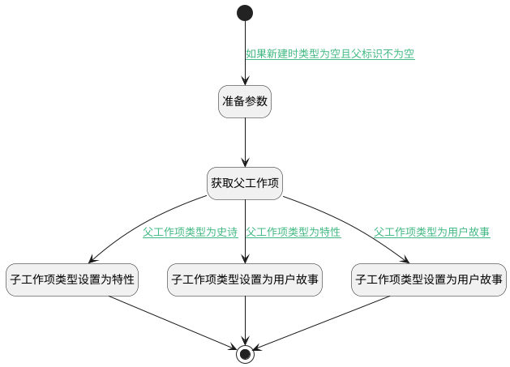

## 需求树表新建时填充类型 <!-- {docsify-ignore-all} -->

   需求树表 新建行操作 根据父级类型判断 填充子的类型

### 处理过程

### 处理步骤说明

#### 开始 :id=Begin [开始]

*- N/A*
#### 准备参数 :id=PREPAREPARAM1 [准备参数]

1. 将`Default(传入变量).PID(父标识)` 设置给  `parent(父工作项).ID(标识)`

#### 获取父工作项 :id=DEACTION1 [实体行为]

调用实体 [工作项(WORK_ITEM)](module/ProjMgmt/Work_item.md) 行为 [Get](module/ProjMgmt/Work_item#行为) ，行为参数为`parent(父工作项)`

将执行结果返回给参数`parent(父工作项)`

#### 子工作项类型设置为特性 :id=PREPAREPARAM2 [准备参数]

1. 将`scrum_feature` 设置给  `Default(传入变量).WORK_ITEM_TYPE_ID(工作项类型)`

#### 子工作项类型设置为用户故事 :id=PREPAREPARAM3 [准备参数]

1. 将`scrum_story` 设置给  `Default(传入变量).WORK_ITEM_TYPE_ID(工作项类型)`

#### 子工作项类型设置为用户故事 :id=PREPAREPARAM4 [准备参数]

1. 将`scrum_story` 设置给  `Default(传入变量).WORK_ITEM_TYPE_ID(工作项类型)`

#### 结束 :id=END1 [结束]

返回 `Default(传入变量)`

### 连接条件说明
#### 如果新建时类型为空且父标识不为空 :id=Begin-PREPAREPARAM1

`Default(传入变量).PID(父标识)` ISNOTNULL AND `Default(传入变量).WORK_ITEM_TYPE_ID(工作项类型)` ISNULL
#### 父工作项类型为史诗 :id=DEACTION1-PREPAREPARAM2

`parent(父工作项).WORK_ITEM_TYPE_ID(工作项类型)` EQ `scrum_epic`
#### 父工作项类型为特性 :id=DEACTION1-PREPAREPARAM3

`parent(父工作项).WORK_ITEM_TYPE_ID(工作项类型)` EQ `scrum_feature`
#### 父工作项类型为用户故事 :id=DEACTION1-PREPAREPARAM4

`parent(父工作项).WORK_ITEM_TYPE_ID(工作项类型)` EQ `scrum_story`

### 实体逻辑参数

|    中文名   |    代码名    |  数据类型    |  实体   |备注 |
| --------| --------| -------- | -------- | --------   |
|传入变量(<i class="fa fa-check"/></i>)|Default|数据对象|[工作项(WORK_ITEM)](module/ProjMgmt/Work_item.md)||
|父工作项|parent|数据对象|[工作项(WORK_ITEM)](module/ProjMgmt/Work_item.md)||
