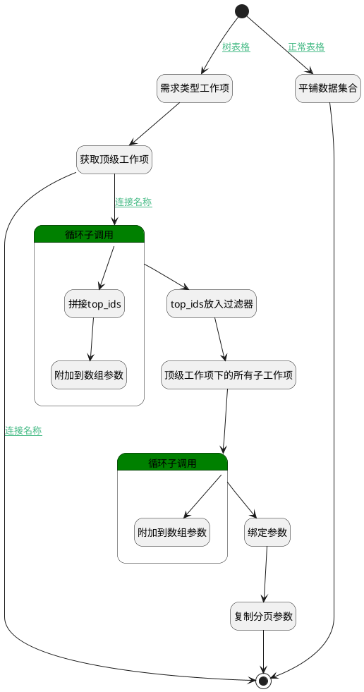

## 需求树表数据查询 <!-- {docsify-ignore-all} -->

   

### 处理过程




### 处理步骤说明

#### 开始 :id=Begin<sup class="footnote-symbol"> <font color=gray size=1>[开始]</font></sup>


*- N/A*
#### 需求类型工作项 :id=PREPAREPARAM3<sup class="footnote-symbol"> <font color=gray size=1>[准备参数]</font></sup>


1. 将`requirement` 设置给  `Default(传入变量).n_work_item_type_group_eq`

#### 平铺数据集合 :id=DEDATASET2<sup class="footnote-symbol"> <font color=gray size=1>[实体数据集]</font></sup>


调用实体 [工作项(WORK_ITEM)](module/ProjMgmt/Work_item.md) 数据集合 [需求工作项(requirement)](module/ProjMgmt/Work_item#数据集合) ，查询参数为`Default(传入变量)`

将执行结果返回给参数`result_page(分页结果)`

#### 获取顶级工作项 :id=DEDATASET1<sup class="footnote-symbol"> <font color=gray size=1>[实体数据集]</font></sup>


调用实体 [工作项(WORK_ITEM)](module/ProjMgmt/Work_item.md) 数据集合 [树表查询(tree_grid)](module/ProjMgmt/Work_item#数据集合) ，查询参数为`Default(传入变量)`

将执行结果返回给参数`page(分页结果)`

#### 循环子调用 :id=LOOPSUBCALL1<sup class="footnote-symbol"> <font color=gray size=1>[循环子调用]</font></sup>


循环参数`page(分页结果)`，子循环参数使用`for_temp(循环临时变量)`
#### 拼接top_ids :id=RAWSFCODE1<sup class="footnote-symbol"> <font color=gray size=1>[直接后台代码]</font></sup>


<p class="panel-title"><b>执行代码[JavaScript]</b></p>

```groovy
var temp = logic.getParam("for_temp");
var work_item = logic.getParam("work_item");
var top_ids = work_item.get("top_ids");
if(top_ids == null){
    top_ids = temp.get("id");
} else {
    top_ids = top_ids + ";" + temp.get("id");
}
work_item.set("top_ids", top_ids);
```

#### 附加到数组参数 :id=APPENDPARAM1<sup class="footnote-symbol"> <font color=gray size=1>[附加到数组参数]</font></sup>


将参数`for_temp(循环临时变量)` 添加到数组参数`result_list(结果列表)`
#### top_ids放入过滤器 :id=PREPAREPARAM1<sup class="footnote-symbol"> <font color=gray size=1>[准备参数]</font></sup>


1. 将`work_item(承载ids属性).top_ids` 设置给  `top_fiter(顶级工作项过滤器).n_top_id_in`
2. 将`requirement` 设置给  `top_fiter(顶级工作项过滤器).n_work_item_type_group_eq`

#### 顶级工作项下的所有子工作项 :id=DEDATASET3<sup class="footnote-symbol"> <font color=gray size=1>[实体数据集]</font></sup>


调用实体 [工作项(WORK_ITEM)](module/ProjMgmt/Work_item.md) 数据集合 [正常状态(normal)](module/ProjMgmt/Work_item#数据集合) ，查询参数为`top_fiter(顶级工作项过滤器)`

将执行结果返回给参数`top_page(顶级工作项分页结果)`

#### 循环子调用 :id=LOOPSUBCALL2<sup class="footnote-symbol"> <font color=gray size=1>[循环子调用]</font></sup>


循环参数`top_page(顶级工作项分页结果)`，子循环参数使用`top_temp(临时变量)`
#### 附加到数组参数 :id=APPENDPARAM2<sup class="footnote-symbol"> <font color=gray size=1>[附加到数组参数]</font></sup>


将参数`top_temp(临时变量)` 添加到数组参数`result_list(结果列表)`
#### 绑定参数 :id=BINDPARAM1<sup class="footnote-symbol"> <font color=gray size=1>[绑定参数]</font></sup>


绑定参数`result_list(结果列表)` 到 `result_page(分页结果)`
#### 结束 :id=END1<sup class="footnote-symbol"> <font color=gray size=1>[结束]</font></sup>


返回 `result_page(分页结果)`

#### 复制分页参数 :id=PREPAREPARAM2<sup class="footnote-symbol"> <font color=gray size=1>[准备参数]</font></sup>


1. 将`page(分页结果).total` 设置给  `result_page(分页结果).total`


### 连接条件说明
#### 树表格 :id=Begin-PREPAREPARAM3

`Default(传入变量).srfshowmode` EQ `tree` AND `Default(传入变量).query` ISNULL
#### 连接名称 :id=DEDATASET1-LOOPSUBCALL1

`page(分页结果).size` GT `0`
#### 连接名称 :id=DEDATASET1-END1

`page(分页结果).size` EQ `0`
#### 正常表格 :id=Begin-DEDATASET2

(`Default(传入变量).srfshowmode` ISNULL OR (`Default(传入变量).srfshowmode` EQ `tree` AND `Default(传入变量).query` ISNOTNULL))


### 实体逻辑参数

|    中文名   |    代码名    |  数据类型    |  实体   |备注 |
| --------| --------| -------- | -------- | --------   |
|传入变量(<i class="fa fa-check"/></i>)|Default|过滤器|||
|循环临时变量|for_temp|数据对象|[工作项(WORK_ITEM)](module/ProjMgmt/Work_item.md)||
|分页结果|page|分页查询|||
|结果列表|result_list|数据对象列表|[工作项(WORK_ITEM)](module/ProjMgmt/Work_item.md)||
|分页结果|result_page|分页查询|||
|顶级工作项过滤器|top_fiter|过滤器|||
|顶级工作项分页结果|top_page|分页查询|||
|临时变量|top_temp|数据对象|[工作项(WORK_ITEM)](module/ProjMgmt/Work_item.md)||
|承载ids属性|work_item|数据对象|[工作项(WORK_ITEM)](module/ProjMgmt/Work_item.md)||
