## 添加附件数据 <!-- {docsify-ignore-all} -->

   

### 处理过程

```plantuml
@startuml
hide footbox
<style>
root {
  HyperlinkColor #42b983
}
</style>

hide empty description
state "开始" as Begin <<start>> [[$./add_attachment#begin {开始}]]
state "结束" as END1 <<end>> [[$./add_attachment#end1 {结束}]]
state "设置附件参数" as RAWJSCODE4  [[$./add_attachment#rawjscode4 {设置附件参数}]]
state "视图部件调用" as VIEWCTRLINVOKE2  [[$./add_attachment#viewctrlinvoke2 {视图部件调用}]]
state "绑定表格部件" as PREPAREJSPARAM1  [[$./add_attachment#preparejsparam1 {绑定表格部件}]]
state "界面行为" as DEUIACTION1  [[$./add_attachment#deuiaction1 {界面行为}]]


Begin --> DEUIACTION1
DEUIACTION1 --> PREPAREJSPARAM1
PREPAREJSPARAM1 --> RAWJSCODE4
RAWJSCODE4 --> VIEWCTRLINVOKE2
VIEWCTRLINVOKE2 --> END1


@enduml
```




### 处理步骤说明

#### 开始 :id=Begin


#### 结束 :id=END1


#### 设置附件参数 :id=RAWJSCODE4


<p class="panel-title"><b>执行代码</b></p>

```javascript
// 计算新建默认值
const defaultData = uiLogic.grid.calcDefaultValue({}, true);
uiLogic.attach = uiLogic.files.map(item => 
    {
        return {
            name: item.name,
            file_id: item.id,
            id: item.uuid,
            ...defaultData,
        }
    }
)
```

#### 视图部件调用 :id=VIEWCTRLINVOKE2


调用`grid(重复器表格)`的方法`addAttachMent`，参数为`attach(附件)`
#### 绑定表格部件 :id=PREPAREJSPARAM1


1. 将`form(表单).details.attachments.mdController` 设置给  `grid(重复器表格)`

#### 界面行为 :id=DEUIACTION1


调用实体 [工作项(WORK_ITEM)](module/ProjMgmt/Work_item.md) 界面行为 [上传附件](module/ProjMgmt/Work_item#界面行为) ，行为参数为`files(上传文件)`


### 实体逻辑参数

|    中文名   |    代码名    |  数据类型      |备注 |
| --------| --------| --------  | --------   |
|表单|form|部件对象||
|当前视图对象|view|当前视图对象||
|附件|attach|数据对象列表||
|传入变量(<i class="fa fa-check"/></i>)|Default|数据对象||
|重复器表格|grid|部件对象||
|上传文件|files|数据对象列表||
