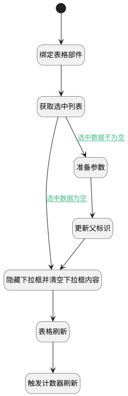

## 添加子工作项值变更 <!-- {docsify-ignore-all} -->

   

### 处理过程




### 处理步骤说明

#### 开始 :id=Begin


#### 表格刷新 :id=VIEWCTRLINVOKE1


调用`grid(表格对象)`的方法`refresh`，参数为`Default(传入变量)`
#### 隐藏下拉框并清空下拉框内容 :id=RAWJSCODE1


<p class="panel-title"><b>执行代码</b></p>

```javascript
const panel = view.layoutPanel.panelItems.choose_data;
if (panel) {
    panel.state.visible = false;
}
uiLogic.default.choose_data = null;
```

#### 绑定表格部件 :id=PREPAREJSPARAM1


1. 将`view(视图对象).layoutPanel.panelItems.grid.control` 设置给  `grid(表格对象)`

#### 获取选中列表 :id=RAWJSCODE2


<p class="panel-title"><b>执行代码</b></p>

```javascript
let choose = uiLogic.default.choose_data;
if (choose != null && choose != '') {
    uiLogic.dto.srfactionparam = JSON.parse(choose);
}
```

#### 更新父标识 :id=DEACTION1


调用实体 [工作项(WORK_ITEM)](module/ProjMgmt/Work_item.md) 行为 [选择子工作项(choose_child)](module/ProjMgmt/Work_item#行为) ，行为参数为`dto(传入后台对象)`

#### 触发计数器刷新 :id=RAWJSCODE3


<p class="panel-title"><b>执行代码</b></p>

```javascript
ibiz.mc.command.update.send({ srfdecodename: 'work_item'})
```

#### 准备参数 :id=PREPAREJSPARAM2


1. 将`ctx(应用上下文变量).work_item` 设置给  `dto(传入后台对象).pid`

### 连接条件说明
#### 选中数据不为空 :id=RAWJSCODE2-PREPAREJSPARAM2

```dto(传入后台对象).srfactionparam``` ISNOTNULL
#### 选中数据为空 :id=RAWJSCODE2-RAWJSCODE1

```dto(传入后台对象).srfactionparam``` ISNULL


### 实体逻辑参数

|    中文名   |    代码名    |  数据类型      |备注 |
| --------| --------| --------  | --------   |
|传入变量(<i class="fa fa-check"/></i>)|Default|数据对象||
|视图对象|view|当前视图对象||
|传入后台对象|dto|数据对象||
|应用上下文变量|ctx|导航视图参数绑定参数||
|表格对象|grid|部件对象||
