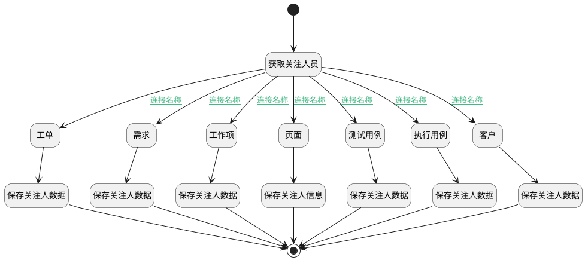

## 关注人员更新 <!-- {docsify-ignore-all} -->

   

### 处理过程




### 处理步骤说明

#### 开始 :id=Begin


#### 保存关注人数据 :id=DEACTION1


调用实体 [工作项(WORK_ITEM)](module/ProjMgmt/Work_item.md) 行为 [Update](module/ProjMgmt/Work_item#行为) ，行为参数为`commit_object(提交对象)`

#### 保存关注人数据 :id=DEACTION6


调用实体 [执行用例(RUN)](module/TestMgmt/Run.md) 行为 [Update](module/TestMgmt/Run#行为) ，行为参数为`commit_object(提交对象)`

#### 保存关注人数据 :id=DEACTION3


调用实体 [工单(TICKET)](module/ProdMgmt/Ticket.md) 行为 [Update](module/ProdMgmt/Ticket#行为) ，行为参数为`commit_object(提交对象)`

#### 获取关注人员 :id=PREPAREJSPARAM2


1. 将`view(当前视图对象).layoutPanel.panelItems.container_attention` 绑定给  `attention_container(关注人容器对象)`
2. 将`attention_container(关注人容器对象).panelItems.attentions.value` 设置给  `commit_object(提交对象).attentions`

#### 工单 :id=PREPAREJSPARAM4


1. 将`ctx(应用上下文).ticket` 设置给  `commit_object(提交对象).id`

#### 保存关注人数据 :id=DEACTION4


调用实体 [客户(CUSTOMER)](module/ProdMgmt/Customer.md) 行为 [Update](module/ProdMgmt/Customer#行为) ，行为参数为`commit_object(提交对象)`

#### 需求 :id=PREPAREJSPARAM3


1. 将`ctx(应用上下文).idea` 设置给  `commit_object(提交对象).id`

#### 工作项 :id=PREPAREJSPARAM1


1. 将`ctx(应用上下文).work_item` 设置给  `commit_object(提交对象).id`

#### 保存关注人信息 :id=DEACTION7


调用实体 [页面(PAGE)](module/Wiki/Article_page.md) 行为 [Update](module/Wiki/Article_page#行为) ，行为参数为`commit_object(提交对象)`

#### 保存关注人数据 :id=DEACTION5


调用实体 [用例(TEST_CASE)](module/TestMgmt/Test_case.md) 行为 [Update](module/TestMgmt/Test_case#行为) ，行为参数为`commit_object(提交对象)`

#### 页面 :id=PREPAREJSPARAM8


1. 将`ctx(应用上下文).article_page` 设置给  `commit_object(提交对象).id`

#### 测试用例 :id=PREPAREJSPARAM7


1. 将`ctx(应用上下文).test_case` 设置给  `commit_object(提交对象).id`

#### 结束 :id=END1


#### 执行用例 :id=PREPAREJSPARAM6


1. 将`ctx(应用上下文).run` 设置给  `commit_object(提交对象).id`

#### 保存关注人数据 :id=DEACTION2


调用实体 [需求(IDEA)](module/ProdMgmt/Idea.md) 行为 [Update](module/ProdMgmt/Idea#行为) ，行为参数为`commit_object(提交对象)`

#### 客户 :id=PREPAREJSPARAM5


1. 将`ctx(应用上下文).customer` 设置给  `commit_object(提交对象).id`

### 连接条件说明
#### 连接名称 :id=PREPAREJSPARAM2-PREPAREJSPARAM1

```ctx(应用上下文).work_item``` ISNOTNULL
#### 连接名称 :id=PREPAREJSPARAM2-PREPAREJSPARAM3

```ctx(应用上下文).idea``` ISNOTNULL
#### 连接名称 :id=PREPAREJSPARAM2-PREPAREJSPARAM4

```ctx(应用上下文).ticket``` ISNOTNULL
#### 连接名称 :id=PREPAREJSPARAM2-PREPAREJSPARAM5

```ctx(应用上下文).customer``` ISNOTNULL
#### 连接名称 :id=PREPAREJSPARAM2-PREPAREJSPARAM7

```ctx(应用上下文).test_case``` ISNOTNULL
#### 连接名称 :id=PREPAREJSPARAM2-PREPAREJSPARAM6

```ctx(应用上下文).run``` ISNOTNULL
#### 连接名称 :id=PREPAREJSPARAM2-PREPAREJSPARAM8

```ctx(应用上下文).article_page``` ISNOTNULL


### 实体逻辑参数

|    中文名   |    代码名    |  数据类型      |备注 |
| --------| --------| --------  | --------   |
|提交对象|commit_object|数据对象||
|应用上下文|ctx|导航视图参数绑定参数||
|当前视图对象|view|当前视图对象||
|传入变量(<i class="fa fa-check"/></i>)|Default|数据对象||
|关注人容器对象|attention_container|数据对象||
