## 新建工作项并生成关联数据 <!-- {docsify-ignore-all} -->

   新建后 生成关联数据（工作项关联工作项 新建时使用）

### 处理过程

```plantuml
@startuml
hide footbox
<style>
root {
  HyperlinkColor #42b983
}
</style>

hide empty description
state "开始" as Begin <<start>> [[$./create_and_relation#begin {开始}]]
state "结束" as END1 <<end>> [[$./create_and_relation#end1 {结束}]]
state "新建需求" as DEACTION1  [[$./create_and_relation#deaction1 {新建需求}]]
state "视图部件调用" as VIEWCTRLINVOKE1  [[$./create_and_relation#viewctrlinvoke1 {视图部件调用}]]
state "新建关联需求" as DEUIACTION1  [[$./create_and_relation#deuiaction1 {新建关联需求}]]
state "获取新建表单数据" as PREPAREJSPARAM1  [[$./create_and_relation#preparejsparam1 {获取新建表单数据}]]


Begin --> PREPAREJSPARAM1
PREPAREJSPARAM1 --> DEACTION1
DEACTION1 --> DEUIACTION1
DEUIACTION1 --> VIEWCTRLINVOKE1
VIEWCTRLINVOKE1 --> END1


@enduml
```

### 处理步骤说明

#### 开始 :id=Begin

#### 结束 :id=END1

#### 新建需求 :id=DEACTION1

调用实体 [工作项(WORK_ITEM)](module/ProjMgmt/Work_item.md) 行为 [Create](module/ProjMgmt/Work_item#行为) ，行为参数为`form_data(表单数据)`

将执行结果返回给参数`Default(传入变量)`

#### 视图部件调用 :id=VIEWCTRLINVOKE1

调用`view(当前视图)`的方法`closeView`，参数为`Default(传入变量)`
#### 新建关联需求 :id=DEUIACTION1

调用实体 [工作项(WORK_ITEM)](module/ProjMgmt/Work_item.md) 界面行为 [新建执行后（建立双向关联数据)](module/ProjMgmt/Work_item#界面行为) ，行为参数为`Default(传入变量)`

#### 获取新建表单数据 :id=PREPAREJSPARAM1

1. 将`form.data` 绑定给  `form_data(表单数据)`
2. 将`Default(传入变量).id` 设置给  `form_data(表单数据).id`

### 实体逻辑参数

|    中文名   |    代码名    |  数据类型      |备注 |
| --------| --------| --------  | --------   |
|当前视图|view|当前视图对象||
|表单数据|form_data|数据对象||
|form|form|部件对象||
|传入变量(<i class="fa fa-check"/></i>)|Default|数据对象||
