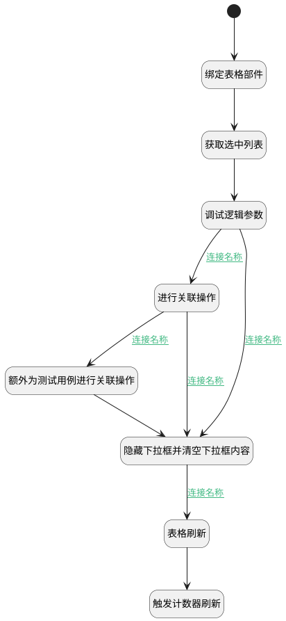

## 关联工作项值变更 <!-- {docsify-ignore-all} -->

   

### 处理过程




### 处理步骤说明

#### 开始 :id=Begin


#### 额外为测试用例进行关联操作 :id=DEACTION2


调用实体 [工作项(WORK_ITEM)](module/ProjMgmt/Work_item.md) 行为 [其他实体关联工单(others_relation_work_item)](module/ProjMgmt/Work_item#行为) ，行为参数为`dto2(执行用例对象)`

#### 进行关联操作 :id=DEACTION1


调用实体 [工作项(WORK_ITEM)](module/ProjMgmt/Work_item.md) 行为 [其他实体关联工单(others_relation_work_item)](module/ProjMgmt/Work_item#行为) ，行为参数为`dto(传入后台对象)`

#### 隐藏下拉框并清空下拉框内容 :id=RAWJSCODE1


<p class="panel-title"><b>执行代码</b></p>

```javascript
const panel = view.layoutPanel.panelItems.choose_data;
if (panel) {
    panel.state.visible = false;
}
uiLogic.default.choose_data = null;
```

#### 调试逻辑参数 :id=DEBUGPARAM1


> [!NOTE|label:调试信息|icon:fa fa-bug]
> 调试输出参数`传入后台对象`的详细信息

#### 表格刷新 :id=VIEWCTRLINVOKE1


调用`grid(表格对象)`的方法`refresh`，参数为`Default(传入变量)`
#### 绑定表格部件 :id=PREPAREJSPARAM1


1. 将`view(视图对象).layoutPanel.panelItems.grid.control` 设置给  `grid(表格对象)`

#### 获取选中列表 :id=RAWJSCODE2


<p class="panel-title"><b>执行代码</b></p>

```javascript
let choose = uiLogic.default.choose_data;
if (choose != null && choose != '') {
    uiLogic.dto.srfactionparam = JSON.parse(choose);
    uiLogic.dto.principal_id = view.context.principal_id;
    uiLogic.dto.principal_type = view.context.principal_type;
    uiLogic.dto.target_type = view.context.target_type;
}
// 如果是执行用例，则为执行用例与测试用例都进行一次关联
if (view.context.run != null && view.context.run != '') {
    uiLogic.dto2.srfactionparam = JSON.parse(choose);
    uiLogic.dto2.principal_id = view.context.test_case;
    uiLogic.dto2.principal_type = 'test_case';
    uiLogic.dto2.target_type = 'bug';
}
```

#### 触发计数器刷新 :id=RAWJSCODE3


<p class="panel-title"><b>执行代码</b></p>

```javascript
ibiz.mc.command.update.send({ srfdecodename: context.principal_type})
```

### 连接条件说明
#### 连接名称 :id=DEBUGPARAM1-DEACTION1

```dto(传入后台对象).srfactionparam``` ISNOTNULL
#### 连接名称 :id=DEACTION1-RAWJSCODE1

```dto2(执行用例对象).srfactionparam``` ISNULL
#### 连接名称 :id=RAWJSCODE1-VIEWCTRLINVOKE1

```dto(传入后台对象).srfactionparam``` ISNOTNULL
#### 连接名称 :id=DEACTION1-DEACTION2

```dto2(执行用例对象).srfactionparam``` ISNOTNULL
#### 连接名称 :id=DEBUGPARAM1-RAWJSCODE1

```dto(传入后台对象).srfactionparam``` ISNULL


### 实体逻辑参数

|    中文名   |    代码名    |  数据类型      |备注 |
| --------| --------| --------  | --------   |
|传入变量(<i class="fa fa-check"/></i>)|Default|数据对象||
|执行用例对象|dto2|数据对象||
|表格对象|grid|部件对象||
|视图对象|view|当前视图对象||
|传入后台对象|dto|数据对象||
