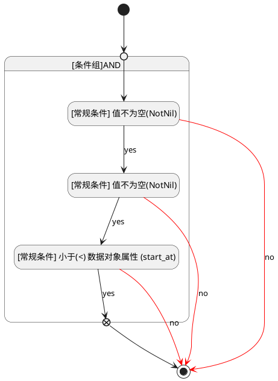

## 结束时间(END_AT) <!-- {docsify-ignore-all} -->

   

### 结束时间大于等于开始时间 :id=date_value_rule



#### 条件说明

##### [常规条件] 值不为空(NotNil) :id=abf44ff4e98313560e6e481bbeea7dec0


`START_AT(开始时间)` ISNOTNULL 

##### [常规条件] 值不为空(NotNil) :id=a8732fdc7293e947dc70cf45938698276


`END_AT(结束时间)` ISNOTNULL 

##### [常规条件] 小于(<) 数据对象属性 (start_at) :id=ac43e9d553ec4485833b3cfc11b2353a7


`END_AT(结束时间)` LT  `start_at`

> [!ATTENTION|label:规则信息|icon:fa fa-warning]
> 结束时间大于等于开始时间


### 默认规则 :id=Default

```plantuml
@startuml
hide empty description
<style>
root {
  HyperlinkColor #42b983
}
</style>


@enduml
```

#### 条件说明


