## 严重程度(SEVERITY) <!-- {docsify-ignore-all} -->

   

### 默认规则 :id=Default

```plantuml
@startuml
hide empty description
<style>
root {
  HyperlinkColor #42b983
}
</style>

state "start" as start  <<start>>
state "end" as end <<end>>
state "默认字符串长度" as f1588eac1225c867df737261c685dc8a [[$./Severity#af1588eac1225c867df737261c685dc8a {"默认字符串长度"}]]


start --> f1588eac1225c867df737261c685dc8a 
f1588eac1225c867df737261c685dc8a --> end 


@enduml
```

#### 条件说明

##### 默认字符串长度 :id=af1588eac1225c867df737261c685dc8a

*关键条件*

`SEVERITY(严重程度)` 属性长度在区间 `(0 , 60]` 内

> [!ATTENTION|label:规则信息|icon:fa fa-warning]
> 内容长度必须小于等于[60]

