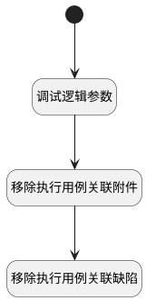

## 移除用例相关信息 <!-- {docsify-ignore-all} -->

   

### 处理过程




### 处理步骤说明

#### 开始 :id=Begin<sup class="footnote-symbol"> <font color=gray size=1>[开始]</font></sup>


*- N/A*
#### 调试逻辑参数 :id=DEBUGPARAM1<sup class="footnote-symbol"> <font color=gray size=1>[调试逻辑参数]</font></sup>


> [!NOTE|label:调试信息|icon:fa fa-bug]
> 调试输出参数`Default(传入变量)`的详细信息


#### 移除执行用例关联附件 :id=RAWSQLCALL1<sup class="footnote-symbol"> <font color=gray size=1>[直接SQL调用]</font></sup>


<p class="panel-title"><b>执行sql语句</b></p>

```sql
DELETE FROM attachment WHERE OWNER_ID = ? ;

```

<p class="panel-title"><b>执行sql参数</b></p>

1. `Default(传入变量).id(标识)`


#### 移除执行用例关联缺陷 :id=RAWSQLCALL2<sup class="footnote-symbol"> <font color=gray size=1>[直接SQL调用]</font></sup>


<p class="panel-title"><b>执行sql语句</b></p>

```sql
DELETE FROM relation WHERE
 TARGET_ID = ? 
 OR PRINCIPAL_ID = ?;

```

<p class="panel-title"><b>执行sql参数</b></p>

1. `Default(传入变量).id(标识)`
2. `Default(传入变量).id(标识)`


### 实体逻辑参数

|    中文名   |    代码名    |  数据类型    |  实体   |备注 |
| --------| --------| -------- | -------- | --------   |
|传入变量(<i class="fa fa-check"/></i>)|Default|数据对象|[执行用例(RUN)](module/TestMgmt/Run.md)||
|附件|attachment|数据对象|[附件(ATTACHMENT)](module/Base/Attachment.md)||
|附件列表|attachments|数据对象列表|[附件(ATTACHMENT)](module/Base/Attachment.md)||
|ID|id|简单数据|||
|选中的ID列表|ids|简单数据列表|||
|临时对象|temp_obj|数据对象|[执行用例(RUN)](module/TestMgmt/Run.md)||
