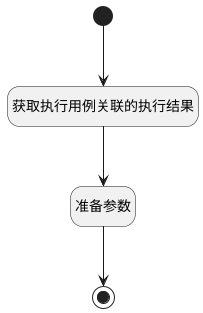

## 执行结果获取 <!-- {docsify-ignore-all} -->

   

### 处理过程




### 处理步骤说明

#### 开始 :id=Begin<sup class="footnote-symbol"> <font color=gray size=1>[开始]</font></sup>


*- N/A*
#### 获取执行用例关联的执行结果 :id=RAWSQLCALL1<sup class="footnote-symbol"> <font color=gray size=1>[直接SQL调用]</font></sup>


<p class="panel-title"><b>执行sql语句</b></p>

```sql
SELECT * FROM run_history t1 WHERE t1.RUN_ID = ? order by t1.create_time desc
```

<p class="panel-title"><b>执行sql参数</b></p>

1. `Default(传入变量).id(标识)`

重置参数`run_history_list(执行结果列表)`，并将执行sql结果赋值给参数`run_history_list(执行结果列表)`

#### 准备参数 :id=PREPAREPARAM1<sup class="footnote-symbol"> <font color=gray size=1>[准备参数]</font></sup>


1. 将`run_history_list(执行结果列表)` 设置给  `Default(传入变量).mdctrl2`

#### 结束 :id=END1<sup class="footnote-symbol"> <font color=gray size=1>[结束]</font></sup>


返回 `Default(传入变量)`


### 实体逻辑参数

|    中文名   |    代码名    |  数据类型    |  实体   |备注 |
| --------| --------| -------- | -------- | --------   |
|传入变量(<i class="fa fa-check"/></i>)|Default|数据对象|[执行用例(RUN)](module/TestMgmt/Run.md)||
|run_history|run_history|数据对象|[执行结果(RUN_HISTORY)](module/TestMgmt/Run_history.md)||
|执行结果列表|run_history_list|数据对象列表|[执行结果(RUN_HISTORY)](module/TestMgmt/Run_history.md)||
