## 执行结果(RUN_STATUS) <!-- {docsify-ignore-all} -->

   

### 默认规则 :id=Default

```plantuml
@startuml
hide empty description
<style>
root {
  HyperlinkColor #42b983
}
</style>

state "start" as start  <<start>>
state "end" as end <<end>>
state "默认字符串长度" as ab0c70281bcb9a4bbdd5d1d905c5efc9 [[$./Run_status#aab0c70281bcb9a4bbdd5d1d905c5efc9 {"默认字符串长度"}]]


start --> ab0c70281bcb9a4bbdd5d1d905c5efc9 
ab0c70281bcb9a4bbdd5d1d905c5efc9 --> end 


@enduml
```

#### 条件说明

##### 默认字符串长度 :id=aab0c70281bcb9a4bbdd5d1d905c5efc9

*关键条件*

`RUN_STATUS(执行结果)` 属性长度在区间 `(0 , 200]` 内

> [!ATTENTION|label:规则信息|icon:fa fa-warning]
> 内容长度必须小于等于[200]

