## 正文格式(FORMAT_TYPE) <!-- {docsify-ignore-all} -->

   

### 默认规则 :id=Default

```plantuml
@startuml
hide empty description
<style>
root {
  HyperlinkColor #42b983
}
</style>

state "start" as start  <<start>>
state "end" as end <<end>>
state "默认字符串长度" as db5d22429bf814201c19a6210be8033d [[$./Format_type#adb5d22429bf814201c19a6210be8033d {"默认字符串长度"}]]


start --> db5d22429bf814201c19a6210be8033d 
db5d22429bf814201c19a6210be8033d --> end 


@enduml
```

#### 条件说明

##### 默认字符串长度 :id=adb5d22429bf814201c19a6210be8033d

*关键条件*

`FORMAT_TYPE(正文格式)` 属性长度在区间 `(0 , 60]` 内

> [!ATTENTION|label:规则信息|icon:fa fa-warning]
> 内容长度必须小于等于[60]

