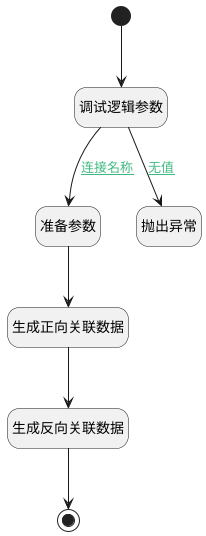

## 其他实体关联空间 <!-- {docsify-ignore-all} -->

   

### 处理过程

### 处理步骤说明

#### 开始 :id=Begin [开始]

*- N/A*
#### 调试逻辑参数 :id=DEBUGPARAM1 [调试逻辑参数]

> [!NOTE|label:调试信息|icon:fa fa-bug]
> 调试输出参数`Default(传入变量)`的详细信息

#### 准备参数 :id=PREPAREPARAM1 [准备参数]

1. 将`Default(传入变量).space_id` 设置给  `relationobj2(反向关系对象).TARGET_ID(关联目标标识)`
2. 将`Default(传入变量).target_type` 设置给  `relationobj2(反向关系对象).TARGET_TYPE(关联目标类型)`
3. 将`Default(传入变量).target_id` 设置给  `relationobj2(反向关系对象).PRINCIPAL_ID(关联主体标识)`
4. 将`Default(传入变量).principal_type` 设置给  `relationobj2(反向关系对象).PRINCIPAL_TYPE(关联主体类型)`
5. 将`Default(传入变量).target_id` 设置给  `relationobj(关系对象).TARGET_ID(关联目标标识)`
6. 将`Default(传入变量).principal_type` 设置给  `relationobj(关系对象).TARGET_TYPE(关联目标类型)`
7. 将`Default(传入变量).space_id` 设置给  `relationobj(关系对象).PRINCIPAL_ID(关联主体标识)`
8. 将`Default(传入变量).target_type` 设置给  `relationobj(关系对象).PRINCIPAL_TYPE(关联主体类型)`

#### 生成正向关联数据 :id=DEACTION1 [实体行为]

调用实体 [关联(RELATION)](module/Base/Relation.md) 行为 [Create](module/Base/Relation#行为) ，行为参数为`relationobj(关系对象)`

#### 生成反向关联数据 :id=DEACTION2 [实体行为]

调用实体 [关联(RELATION)](module/Base/Relation.md) 行为 [Create](module/Base/Relation#行为) ，行为参数为`relationobj2(反向关系对象)`

#### 抛出异常 :id=THROWEXCEPTION1 [抛出异常]

> [!ATTENTION|label:抛出异常|icon:fa fa-warning]
> 错误信息：未指定需要关联的空间

#### 结束 :id=END1 [结束]

*- N/A*

### 连接条件说明
#### 连接名称 :id=DEBUGPARAM1-PREPAREPARAM1

`Default(传入变量).space_id` ISNOTNULL AND `Default(传入变量).target_id` ISNOTNULL
#### 无值 :id=DEBUGPARAM1-THROWEXCEPTION1

(`Default(传入变量).target_id` ISNULL OR `Default(传入变量).space_id` ISNULL)

### 实体逻辑参数

|    中文名   |    代码名    |  数据类型    |  实体   |备注 |
| --------| --------| -------- | -------- | --------   |
|传入变量(<i class="fa fa-check"/></i>)|Default|数据对象|[空间(SPACE)](module/Wiki/Space.md)||
|关系对象|relationobj|数据对象|[关联(RELATION)](module/Base/Relation.md)||
|反向关系对象|relationobj2|数据对象|[关联(RELATION)](module/Base/Relation.md)||
