## 打开新建页面并关闭模板中心 <!-- {docsify-ignore-all} -->

   

### 处理过程

```plantuml
@startuml
hide footbox
<style>
root {
  HyperlinkColor #42b983
}
</style>

hide empty description
state "开始" as Begin <<start>> [[$./open_new_page#begin {开始}]]
state "准备参数" as PREPAREJSPARAM1  [[$./open_new_page#preparejsparam1 {准备参数}]]
state "结束" as END1 <<end>> [[$./open_new_page#end1 {结束}]]
state "界面行为" as DEUIACTION1  [[$./open_new_page#deuiaction1 {界面行为}]]


Begin --> PREPAREJSPARAM1
PREPAREJSPARAM1 --> DEUIACTION1
DEUIACTION1 --> END1


@enduml
```

### 处理步骤说明

#### 开始 :id=Begin

#### 准备参数 :id=PREPAREJSPARAM1

1. 将`view(视图).layoutPanel.panelItems.nav_pos` 绑定给  `nav_pos(导航区占位)`
2. 将`为什么拿不到呢` 设置给  `new_page_info(新建页面信息).aaa`
3. 将`nav_pos(导航区占位).curNavViewMsg.key` 设置给  `new_page_info(新建页面信息).stencil_id`
4. 将`nav_pos(导航区占位).curNavViewMsg.key` 设置给  `ctx(上下文参数).stencil_id`
5. 将`空值（NULL）` 设置给  `ctx(上下文参数).article_page`

#### 结束 :id=END1

#### 界面行为 :id=DEUIACTION1

调用实体 [页面(PAGE)](module/Wiki/Article_page.md) 界面行为 [从模板新建（打开从模板新建视图）](module/Wiki/Article_page#界面行为) ，行为参数为`new_page_info(新建页面信息)`

### 实体逻辑参数

|    中文名   |    代码名    |  数据类型      |备注 |
| --------| --------| --------  | --------   |
|视图|view|当前视图对象||
|传入变量(<i class="fa fa-check"/></i>)|Default|数据对象||
|列表|listexpbar|部件对象||
|上下文参数|ctx|导航视图参数绑定参数||
|新建页面信息|new_page_info|数据对象||
|导航区占位|nav_pos|部件对象||
