## 检查间隔(CHECKTIMER) <!-- {docsify-ignore-all} -->

   

### 默认规则 :id=Default

```plantuml
@startuml
hide empty description
<style>
root {
  HyperlinkColor #42b983
}
</style>

state "start" as start  <<start>>
state "end" as end <<end>>
state "默认值范围" as 4f9e2bfda2248cee9a554c9a0e519d61 [[$./CheckTimer#a4f9e2bfda2248cee9a554c9a0e519d61 {"默认值范围"}]]


start --> 4f9e2bfda2248cee9a554c9a0e519d61 
4f9e2bfda2248cee9a554c9a0e519d61 --> end 


@enduml
```

#### 条件说明

##### 默认值范围 :id=a4f9e2bfda2248cee9a554c9a0e519d61

*关键条件*

`CHECKTIMER(检查间隔)` 值在区间 `
(-∞ , 1440.0]` 内

> [!ATTENTION|label:规则信息|icon:fa fa-warning]
> 数值必须大于等于[0]且小于等于[1440]

