## 用户标识3(USERTAG3) <!-- {docsify-ignore-all} -->

   

### 默认规则 :id=Default

```plantuml
@startuml
hide empty description
<style>
root {
  HyperlinkColor #42b983
}
</style>

state "start" as start  <<start>>
state "end" as end <<end>>
state "默认字符串长度" as ec681a45be77071afe87ed1b4cea41ed [[$./UserTag3#aec681a45be77071afe87ed1b4cea41ed {"默认字符串长度"}]]


start --> ec681a45be77071afe87ed1b4cea41ed 
ec681a45be77071afe87ed1b4cea41ed --> end 


@enduml
```

#### 条件说明

##### 默认字符串长度 :id=aec681a45be77071afe87ed1b4cea41ed

*关键条件*

`USERTAG3(用户标识3)` 属性长度在区间 `(0 , 50]` 内

> [!ATTENTION|label:规则信息|icon:fa fa-warning]
> 内容长度必须小于等于[50]

