## 最后更新人(UPDATER) <!-- {docsify-ignore-all} -->

   

### 默认规则 :id=Default

```plantuml
@startuml
hide empty description
<style>
root {
  HyperlinkColor #42b983
}
</style>

state "start" as start  <<start>>
state "end" as end <<end>>
state "默认字符串长度" as ce2bea0677d62cc1565aac336699474b [[$./Updater#ace2bea0677d62cc1565aac336699474b {"默认字符串长度"}]]


start --> ce2bea0677d62cc1565aac336699474b 
ce2bea0677d62cc1565aac336699474b --> end 


@enduml
```

#### 条件说明

##### 默认字符串长度 :id=ace2bea0677d62cc1565aac336699474b

*关键条件*

`UPDATER(最后更新人)` 属性长度在区间 `(0 , 100]` 内

> [!ATTENTION|label:规则信息|icon:fa fa-warning]
> 内容长度必须小于等于[100]

