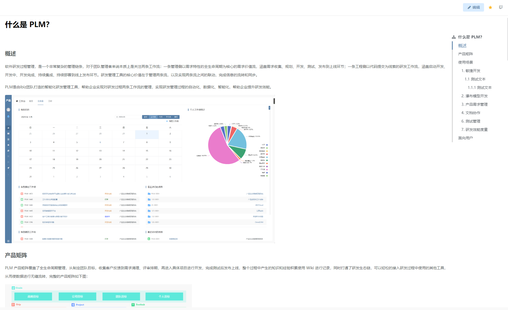

# 锚点富文本

该插件基于直接内容（HTML）增强，主要是可以根据富文本HTML的内容自动生成锚点目录, 单击目录项可以自动滚动到具体内容位置等。**该插件隶属于编辑器自定义绘制插件（基于直接内容进行扩展）**


## 页面展示




## 功能说明

- 可以根据富文本HTML的内容自动生成锚点（依照标题级别，h1~h6）

- 可以预览富文本的图片

- 支持自定义设置锚点标题，标题内容根据配置的TITLE属性在表单中获取


## 输入参数

| 属性      | 类型         | 默认值 | 说明                                                  |
| --------- | ----------- | ------ | ----------------------------------------------------- |
| TITLE     | string      | ---     | 自定义设置锚点标题, 根据配置的TITLE属性字段在表单中获取值 |

### 配置示例

```
TITLE=name
```

## 附录

### 锚点富文本插件

```json
[
  {
    "plugintype": "EDITOR_CUSTOMSTYLE",
    "rtobjectrepo": "@ibiz-template-plm/ancho-html@0.0.2-dev.142",
    "codename": "UsrPFPlugin0306863665",
    "plugintag": "ANCHO_HTML",
    "rtobjectmode": 2,
    "rtobjectname": "AnchoHtml",
    "pssyspfpluginname": "锚点富文本"
  }
]
```

### 编辑器样式

```json
[
  {
    "codename": "ANCHO_HTML",
    "pssyspfpluginid": "UsrPFPlugin0306863665",
    "repdefault": 0,
    "validflag": 1,
    "pssyseditorstylename": "锚点富文本",
    "pseditortypeid": "RAW"
  }
]
```
