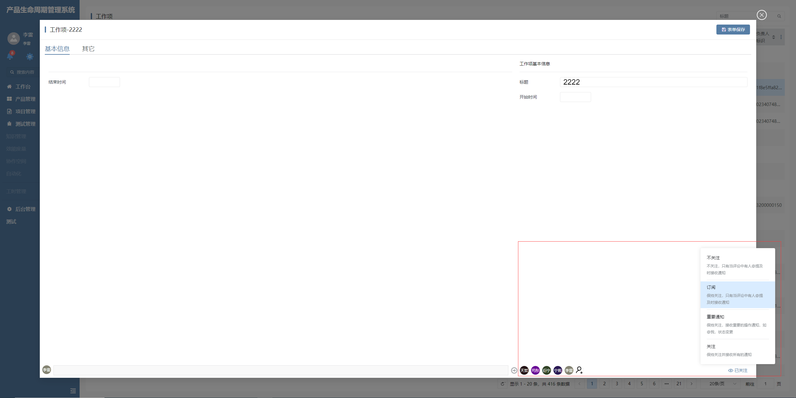

# 关注

该插件基于数据选择（下拉）增强，主要用于在所有人员中或登录者所在部门之中选择关注人，当前登录者能够自定义自己的关注状态。**该插件隶属于编辑器自定义绘制插件（基于数据选择（下拉）进行扩展）**


## 页面展示




## 功能说明

* 关注人员超出后，超出范围会隐藏并显示...

* 默认支持OBJECTS数据

* 配置自定义请求，请求部门人员及所有人员

* 选择关注人时对当前登录者UI呈现单独处理

* 设置当前登录者的关注状态，可根据配置的【DEFAULTATNVALUE】设置关注状态


## 输入参数

| 参数            | 类型       | 默认值  | 说明                                                         |
| --------------- | ---------- | ------- | ------------------------------------------------------------ |
| URL             | string     | ---     | 人员数据的请求URL，可通过配置${context.xxx}或者${data.xxx}来动态更新URL<br />示例：URL=projects/${context.project}/project_members/fetchdefault |
| DEPTURL         | string     | ---     | 部门人员数据的请求URL，可通过配置${context.xxx}或者${data.xxx}来动态更新URL<br />示例：DEPTURL=/users/fetchdefault |
| SRFNAVPARAM     |            | ---     | 支持配置导航参数，导航参数解析后会在人员或者部门人员请求时被携带上<br />示例：SRFNAVPARAM.n_department_id_eq=%srforgsectorid%,<br/> |
| SRFNAVCTX       |            | ---     | 支持配置导航上下文，导航上下文解析后会在人员或者部门人员的请求Url上进行匹配替换<br />示例：SRFNAVCTX.project=%project% |
| DEPTMAP         |            | ---     | 允许自定义部门人员的【id】和【name】的映射字段，如果未配置，则会直接使用【id】和【name】<br />示例：DEPTMAP={"id":"id","name":"display_name"} |
| USERMAP         |            | ---     | 允许自定义人员的【id】和【name】的映射字段，如果未配置，则会直接使用【id】和【name】<br />示例：USERMAP={"id":"user_id","name":"name"} |
| USERMETHOD      | post\| get | post    | 人员请求接口的请求方式<br />示例：USERMETHOD='post'          |
| CODELISTID      | string     | ---     | 代码表模板解析出来的代码表codeName <br />示例：Base__Attention_type |
| CODELISTMAP     | Object     | ---     | 代码表值与关注类型的映射，定义属于不关注的代码表值及属于关注的代码表值集合。<br />示例：{ FOLLOWED: [20, 30, 40], NOTFOLLOWING: [10] } |
| DEFAULTATNVALUE | string     | ---     | 在人员或部门中选中当前登录者时，指定默认的关注类型。<br />40 |
| SELFFILLMAP     | Object     | ---     | 允许自定义关注人的【user_id】和【user_name】的映射字段，如果未配置，则会直接使用【user_id】和【name】<br />示例：{"user_id":"user_id","user_name":"name"} |
| VALUETYPE       | string     | OBJECTS | 值类型                                                       |

注：如果只想只读展示，需要在编辑器参数中设置readonly=true， 如果允许进行编辑，需要配置对应的值项。


### 配置示例

```
URL=projects/${context.project}/project_members/fetchdefault
DEPTURL=/users/fetchdefault
SRFNAVPARAM.n_department_id_eq=%srforgsectorid%
USERMAP={"id":"user_id","name":"name"}
DEPTMAP={"id":"id","name":"display_name"}
USERMETHOD=post
DEPTMETHOD=get
CODELISTID=Base__Attention_type
CODELISTMAP={"FOLLOWED":[20,30,40],"NOTFOLLOWING":[10]}
DEFAULTATNVALUE=40
SELFFILLMAP={"user_id":"user_id","user_name":"name"}

readonly=true
```


## 附录

### 关注插件

```json
[
  {
    "plugintype": "EDITOR_CUSTOMSTYLE",
    "rtobjectrepo": "@ibiz-template-plm/attention@0.0.2-dev.150",
    "codename": "UsrPFPlugin0222550318",
    "plugintag": "ATTENTION",
    "rtobjectmode": 2,
    "rtobjectname": "IBizAttention",
    "pssyspfpluginname": "关注"
  }
]
```

### 编辑器样式

```json
[
  {
    "codename": "ATTENTION",
    "pssyspfpluginid": "UsrPFPlugin0222550318",
    "repdefault": 0,
    "validflag": 1,
    "pssyseditorstylename": "关注",
    "pseditortypeid": "PICKEREX_TRIGGER"
  }
]
```