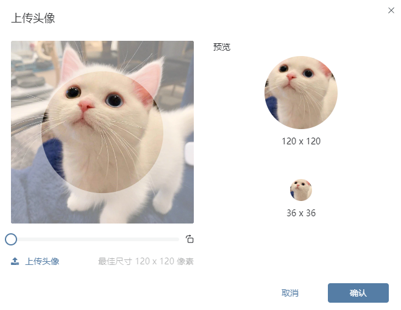

# 头像自定义插件

该插件基于图片（单项）编辑器增强，主要用于选择自定义的头像，并可对头像图片的一部分进行截取作为头像。

## 页面展示

## 主要功能以及核心逻辑

* 选择图片文件

  仅支持JPEG,JPG,PNG类型文件，在选择文件后，会打开一个剪切模态，在模态中，可对图像做进一步处理，当点击确认后才会上传头像文件。

* 剪切联动

  ​	在选择图像文件后，可对图像文件进行剪切，并可以对图形进行放大，从而可以截取一部分内容生成新的头像文件。

  ​	当鼠标进入裁剪框并按下左键时将会被允许拖动裁剪框，根据鼠标的移动路径生成当前的裁剪框的实时位置，即裁剪框的中心点的x和y坐标，并动态的更改裁剪框容器的样式，从而实现裁剪框的移动。

  ​	在裁剪框移动时，会计算裁剪框的中心点距离本身宽高边界的距离，这个距离减去裁剪框半径再减去图片居中时产生的空白边界，即可得出裁剪框的移动范围。

  ​	同时，右侧预览图会根据左侧裁剪框距离自身边界的长度，以及预览框的大小与裁剪框大小之间的比去计算出右侧预览框此时图片的偏移距离，保证裁剪框内容与预览框一致。

* 证照模式
  可配置编辑器参数 `cutShape=IDRECT`, 当配置了此编辑器参数时，裁剪框会变成长方形，仅可左右拖动，裁剪框宽高等比例一寸证件照大小，同时，保存时，将会按照一寸证件照的大小等比例裁剪出图片作为头像保存。