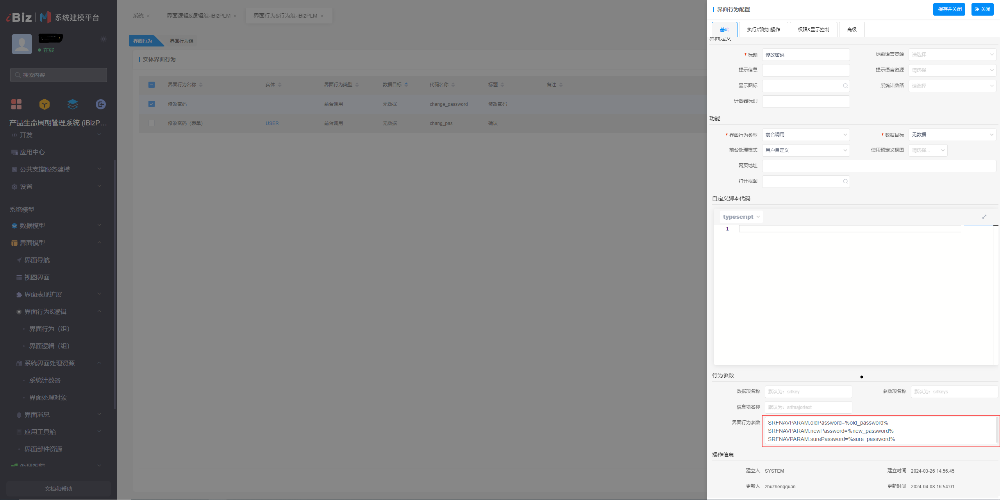

# 修改密码

该插件基于应用实体界面行为增强，主要是用于用户密码的修改，用户需输入旧密码和新密码，随后点击确认按钮，即可完成密码修改操作。**该插件隶属于应用实体界面行为插件（基于界面行为进行扩展）**


## 示例展示


## 功能说明

- 修改当前登录者的密码

- 在编辑视图中，输入新旧密码并确认后，即可修改密码


## 配置示例

### 导航参数配置

```
SRFNAVPARAM.oldPassword=%old_password%
SRFNAVPARAM.newPassword=%new_password%
SRFNAVPARAM.surePassword=%sure_password%
```
表单属性映射：oldPassword对应旧密码，newPassword对应新密码，surePassword对应确认新密码。




## 附录

### 修改密码插件

```json
[
  {
    "plugintype": "DEUIACTION",
    "rtobjectrepo": "@ibiz-template-plugin/change-password@0.0.3-dev.60",
    "codename": "UsrPFPlugin0326346903",
    "plugintag": "CHANGE_PASSWORD",
    "rtobjectmode": 2,
    "rtobjectname": "registerChangePasswordProvider",
    "pssyspfpluginname": "修改密码"
  }
]
```

