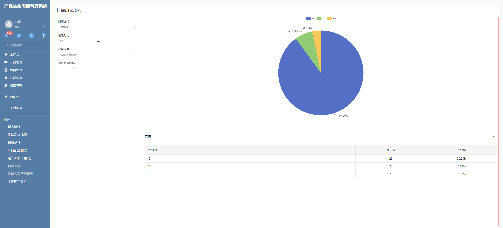
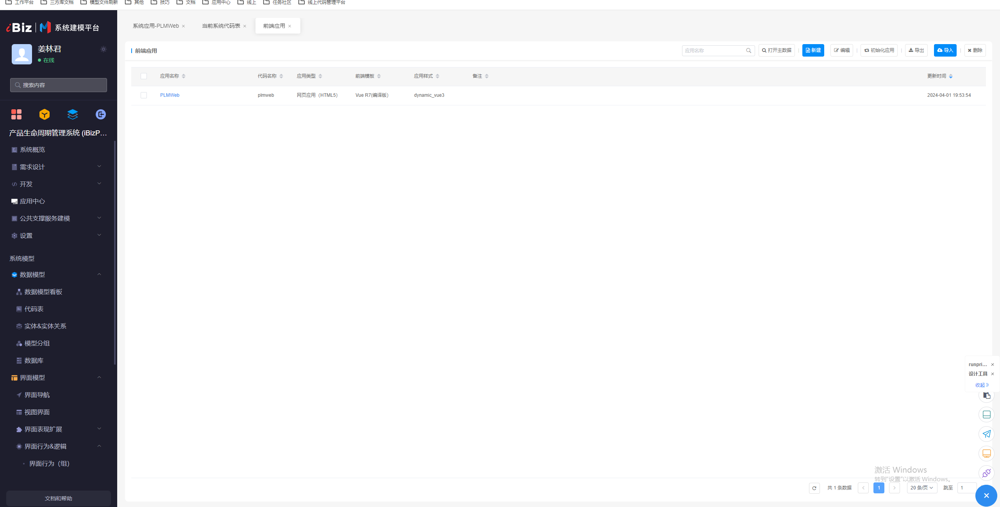
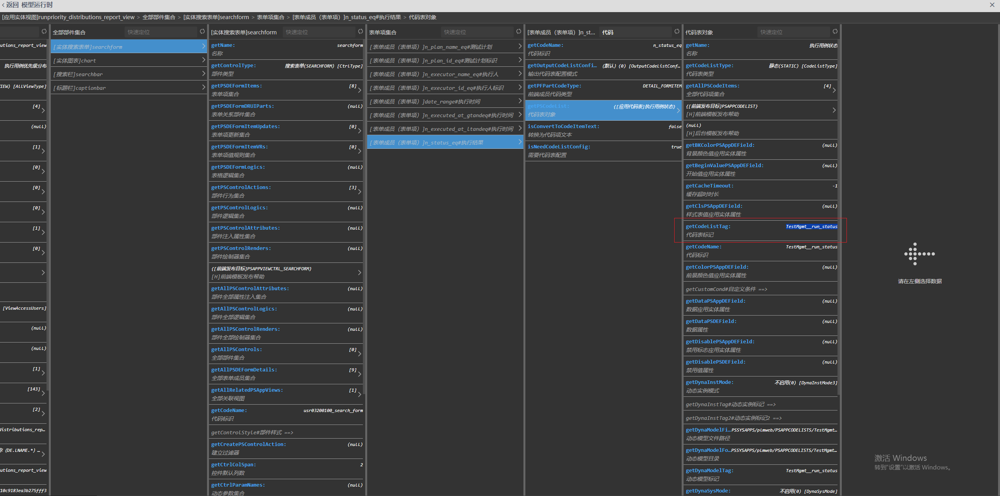

# 报表详情插件

该插件基于图表部件增强，主要功能是在显示配置的图表的基础上，同时绘制一个简单表格去辅助图表进行数据展示。

## 页面示例：



## 主要功能

**动态序列：**

 允许设置图表序列为动态序列，可以根据搜索项的值去动态显示每一个序列对应表示的图表。

**绘制表格：**

* 自定义表格列：在使用动态序列时，每个序列可以定义自己对应的表格，也可以统一在图表自定义参数里进行配置，使用同一个表格；在使用静态序列时，表格列只允许在图表自定义参数里进行配置且必须配置。

* 根据序列绘制表格：当序列都为静态序列时，如果此时这些序列配置了同一分组模式，那么此时需要在图表上配置参数【gridHeaders】,配置格式如下：

  `EC.gridHeaders=[{"id":"srfgroup","name":"日期"}]`

  配置了此参数，那么表格就将以配置的序列作为表格的列来绘制。

* 多序列绘制：在当序列只有一个且为静态序列时，如果该序列上同时配置了分类属性以及值属性和标识属性，同时，在图表自定义参数上配置了多序列平铺模式，如下：

  ```
  EC.groupSerieMode=true
  ```

  则图表进入特殊模式，该模式下，图表会根据配置的标识属性对返回数据进行分组，每个分组会基于初始配置的序列构建一个新的序列模型，最终形成一个多序列的图表配置，同时在该模式下，需要以下配置：

  * 在图表配置中，同时配置    `EC.legend={"show": true}`  用来显示序列图例
  * 在序列参数上配置    `EC.label={"show": true,"position":"bottom","formatter":"{a}"}`   用来保证多序列绘制时序列label能正常显示在X轴下方，根据需要，也可参考echart配置对其做一定修改。
  * 在坐标轴自定义参数上配置    `EC.axisLabel={"margin":36}`  因为是使用了分类属性作为大分组，标识属性作为序列分组 所以需要这样设置以保证分类属性的label 和序列属性的label不会重合在一起，可根据需要调整具体数值，其他配置参考ehcart

  在该模式下，图表同时支持在图表自定义参数上进行如下配置：  

  ```
  EC.showGridCaption=true
  EC.showGridPrcent=true
  EC.showGridTotal=true
  ```

  第一个参数表示开启表格控制，第二个参数表示显示表格count列百分比的按钮，第三个表示显示表格合计的按钮，合计会统计count列的总数，百分比会显现每一行的count占总数的比例。

## 输入参数

| 输入参数        | 类型     | 默认值 | 说明                                                         |
| --------------- | -------- | ------ | ------------------------------------------------------------ |
| gridHeaders     | JSON数组 |        | 这个参数必须配置，值为一个JSON数组。                         |
| showGridCaption | boolean  | false  | 是否显示表格控制，设置为true后可收缩表格                     |
| isDynamicChart  | boolean  | false  | 表示当前序列是否为动态序列                                   |
| groupSerieMode  | boolean  | false  | 开启多序列平铺模式                                           |
| showGridPrcent  | boolean  | false  | 显示表格count列百分比的按钮，showGridCaption=true且groupSerieMode=true时有效 |
| showGridTotal   | boolean  | false  | 显示表格合计的按钮，showGridCaption=true且groupSerieMode=true时有效 |
| codeListTag     | string   |        | 在启用了多序列平铺模式时，配置标识属性对应的代码表的名称     |

**注：**当图表中配置了序列为动态序列时,那么图表中的动态序列就会随搜索的状态变化而切换显示，序列根据配置的序列名称与搜索表单项中的groupcond的值一一对应，当启用动态序列时，可在序列里面配置参数【gridHeaders】,那么当切换到对应的动态序列时，表格就展示为当前序列配置的表格。

表格的列可以自定义，JSON数组的顺序就是表格列的顺序（从左至右），在表格中，默认支持了百分比（id为【srfpercent】,使用返回数据中的count进行计算）,当图表所有序列都为静态序列时，表格只允许在图表自定义参数上进行配置，此时插件支持属性【srfgroup】,如果所有序列都配置了同一分组模式时，即可将每一个序列作为表格的一个列进行绘制。

配置示例

```
EC.gridHeaders=[{"id":"filter_type","name":"状态"},{"id":"count","name":"需求数"},{"id":"srfpercent","name":"百分比"}]
EC.showGridCaption=true
```

代码表配置示例：

```
EC.codeListTag=plmweb.testmgmt__run_status
```

注：代码表名称为应用名称小写拼接点（.）再拼接代码表标记，全部小写





## 附录

### 插件模型

```
[
  {
    "plugintype": "CHART_RENDER",
    "rtobjectrepo": "@ibiz-template-plm/chart-grid@0.0.3-dev.36",
    "codename": "UsrPFPlugin0318166417",
    "plugintag": "CHART_GRID",
    "rtobjectmode": 2,
    "rtobjectname": "ChartGrid",
    "pssyspfpluginname": "图表-报表详情插件"
  }
]
```

