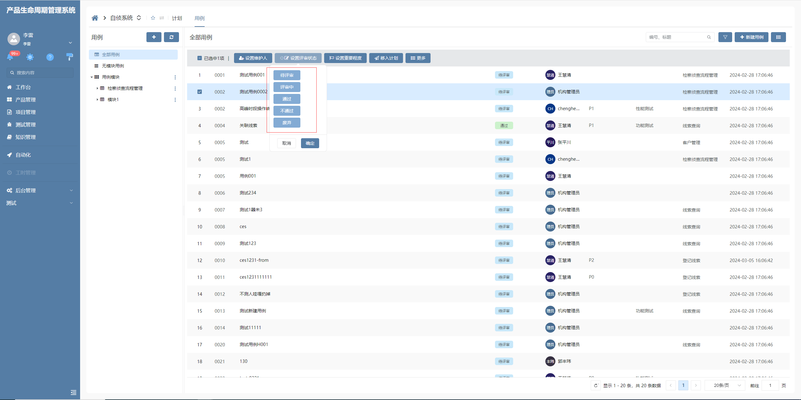
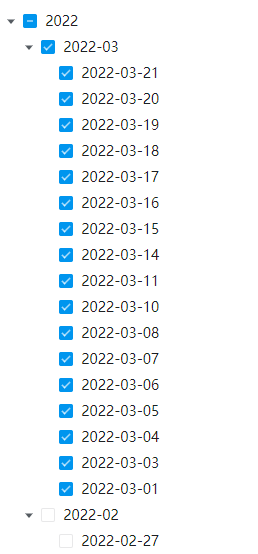
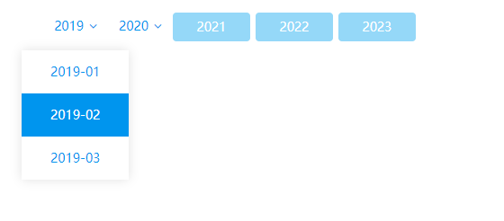
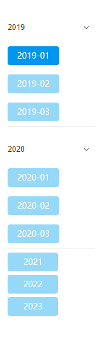

# 选项框列表增强

该插件基于选项列表框增强，主要是由于选项列表框编辑器功能单一，呈现模式简单。并且不能支持多选，以及按钮样式绘制。**该插件隶属于编辑器自定义绘制插件（基于选项框列表进行扩展）**


## 页面展示



该插件主要针对选项列表框功能单一，呈现模式简单进行增强，具体增加的功能的如下：

- 树形选项列表

  

- 水平树型选项列表

  

- 按钮选项列表

  单选：

  

  多选：

  

- 分组按钮选项列表

  

- 折叠按钮选项列表

  

隶属于编辑器插件**（基于选项框列表标准编辑器扩展）**


## 功能说明

- 支持按钮样式及选项框样式绘制

- 支持单多选逻辑

- 支持树选项框绘制

- 支持按钮绘制模式，平铺绘制及折叠绘制


## 输入参数

| 名称             | 类型                                                     | 默认值   | 说明                                               |
| ---------------- | -------------------------------------------------------- | -------- | -------------------------------------------------- |
| GROUPMODEL       | YEAR/QUARTER/MONTH/WEEK/<br />DAY/CODELIST/FIELD/NOGROUP | NOGROUP  | 分组模式                                           |
| GROUPFIELD       | string                                                   | value    | 分组属性，树结构判断标识                           |
| GROUPCODELIST    | Array                                                    | —        | 根节点值，分组属性判断根值                         |
| EMPTYVALUE       | string                                                   | —        | 当未选中数据时抛值                                 |
| RENDERMODE       | TREE/BUTTON                                              | TREE     | 绘制模式                                           |
| MODE             | horizontal/vertical                                      | vertical | 模式                                               |
| DATESORT         | DESC \| ASC                                              | —        | 时间排序，如果代码表数据为时间类型，将对其进行排序 |
| LOADAFTER        | scriptCode => Object[]                                   | —        | 加载之后事件hook，可对代码表数据进行调整           |
| SETDEFAULTSELECT | scriptCode => string[]                                   | —        | 设置默认选中数据                                   |
| SINGLESELECT     | boolean                                                  | false    | 单项选择，为true时列表框为单选                     |

配置的scriptCode会被转换为js函数脚本

```
LOADAFTER=return [{ text: '全选', value: 'all', children: items }]

该配置将会转换为
(items: IData[],context: IContext, params: IParams, data: IData) => {
	return [{ text: '全选', value: 'all', children: items }]
}
```


## 配置示例

### 水平树选项列表

```
groupModel=CODELIST
GROUPFIELD=VALUE
GROUPCODELIST=[{"text":"分类一","value":"kind1"},{"text":"分类二","value":"kind2"},{"text":"分类三","value":"kind3"}]
LOADAFTER=return [{ text: '全选', value: 'all', children: items }]
```

### 禁用某一项

```
LOADAFTER=const index = items.findIndex((item) => Object.is(item.value, 'QQ'));if (index !== -1) {Object.assign(items[index], { disableSelect: true })}return [{ text: '全选', value: 'all', children: items}]
```


### 默认选中

```
SETDEFAULTSELECT=return ['微信']
```

### 单项选择

```
RENDERMODE=BUTTON
SINGLESELECT=true
```

### 多项选择

```
RENDERMODE=BUTTON
SINGLESELECT=false
```

### 按钮样式竖向布局分组

```
RENDERMODE=BUTTON
MODE=vertical
GROUPCODELIST=[{"text":"2019","value":"kind1"},{"text":"2020","value":"kind2"},{"text":"2021","value":"kind3"}]
```

### 按钮样式横向布局分组

```
RENDERMODE=BUTTON
MODE=horizontal
GROUPCODELIST=[{"text":"2019","value":"kind1"},{"text":"2020","value":"kind2"},{"text":"2021","value":"kind3"}]
```


## 基本使用

在具体项目中，先通过模型导入编辑器插件、再导入编辑器样式，最后在具体的表单中选择对应的编辑器样式即可复用，其中编辑器插件和编辑器样式具体数据参见附录，相关示例如下。


## 附录

### 选项框列表增强插件

```json
[
  {
    "plugintype": "EDITOR_CUSTOMSTYLE",
    "rtobjectrepo": "@ibiz-template-plugin/checkbox-list-extend@0.1.2-alpha.0",
    "codename": "UsrPFPlugin1203975787",
    "plugintag": "EXTEND",
    "rtobjectmode": 2,
    "rtobjectname": "IBizCheckboxListExtend",
    "pssyspfpluginname": "选项框列表增强"
  }
]
```

### 编辑器样式：

```json
[
  {
    "codename": "EXTEND",
    "pssyspfpluginid": "UsrPFPlugin1203975787",
    "repdefault": 0,
    "validflag": 1,
    "pssyseditorstylename": "选项框列表增强",
    "pseditortypeid": "CHECKBOXLIST"
  }
]
```
