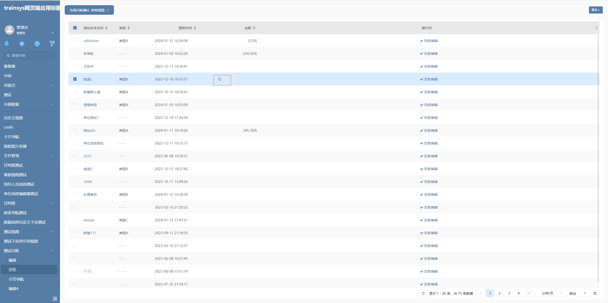
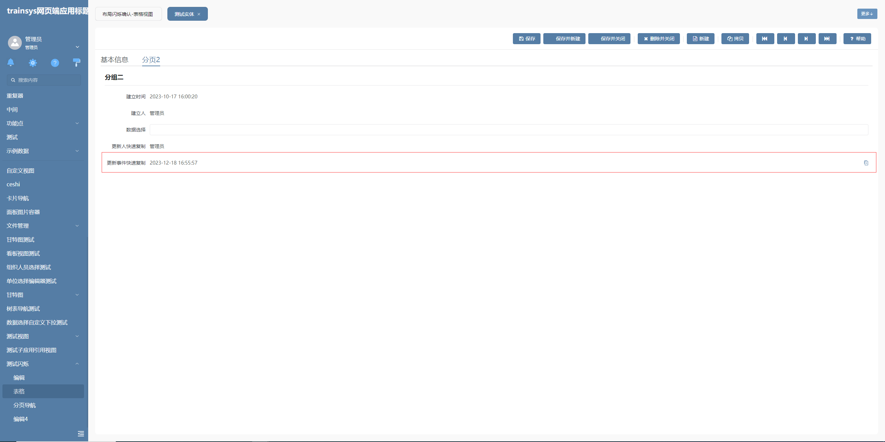

# 剪切板

该插件分为两部分，第一部分基于表格列增强，主要功能为鼠标移入后会在表格列最右边出现复制图标，点击该图标可以快速复制当前显示的文本，**该插件隶属于数据表格列绘制插件（基于表格列进行的扩展）**。

第二部分基于标签编辑器增强，在鼠标移入后同样会显示一个复制图标，点击即可复制当前标签显示值，**该插件隶属于编辑器自定义绘制插件（基于标签编辑器进行的扩展）**。

## 页面展示




## 功能说明

### 快速复制

- 表格属性列中快速复制文本

- 标签编辑器中快速复制文本

## 基本使用

在具体项目中，先通过模型导入剪切板表格属性列插件、剪切板标签插件、剪切板标签编辑器样式。然后在表格列中配置剪切板表格属性列插件，在标签编辑器中，选择剪切板样式。

## 附录

### 剪切板表格属性列插件

```json
[
  {
    "plugintype": "GRID_COLRENDER",
    "rtobjectrepo": "@ibiz-template-plm/clip-board@0.0.2-dev.151",
    "codename": "UsrPFPlugin0201763931",
    "plugintag": "CLIP_BOARD_FIELDCOLUMN",
    "rtobjectmode": 2,
    "rtobjectname": "IBizClipBoard",
    "pssyspfpluginname": "剪切板表格属性列"
  }
]
```

### 剪切板标签插件

```json
[
  {
    "plugintype": "EDITOR_CUSTOMSTYLE",
    "rtobjectrepo": "@ibiz-template-plm/clip-board@0.0.2-dev.151",
    "codename": "UsrPFPlugin0201147549",
    "plugintag": "CLIP_BOARD_SPAN",
    "rtobjectmode": 2,
    "rtobjectname": "IBizClipBoard",
    "pssyspfpluginname": "剪切板（标签）"
  }
]
```

### 编辑器样式

```json
[
  {
    "codename": "CLIP_BOARD_SPAN",
    "pssyspfpluginid": "UsrPFPlugin0201147549",
    "repdefault": 0,
    "validflag": 1,
    "pssyseditorstylename": "剪切板样式",
    "pseditortypeid": "SPAN"
  }
]
```
