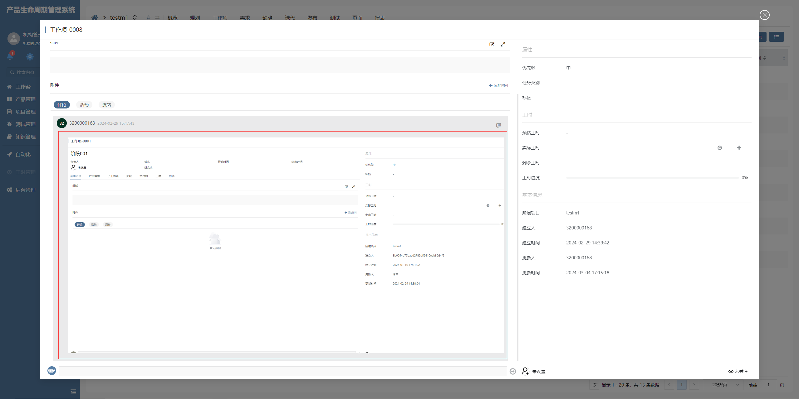

# 评论列表项

该插件基于直接内容增强，主要增强了图片预览功能，在直接内容中绘制的图片可以点击预览。**该插件隶属于编辑器自定义绘制插件（基于直接内容进行扩展）**

## 页面展示



## 功能说明

- 图片预览

- 按 esc 按键关闭图片预览

## 输入参数

| 属性        | 类型   | 默认值 | 说明                 |
| ----------- | ------ | ------ | -------------------- |
| contenttype | string | TEXT   | 返回数据的内容类型   |
| SCRIPTCODE  | string | ---    | 通过脚本处理返回数据 |

### 配置示例

```
contenttype=HTML
SCRIPTCODE=data.content?.replace(/@{[^,]*,\"name\":\"(.*?)\"}/g,\"<span class='comment-tag'>@$1</span>\").replace(/@{[^,]*,name=(.*?)}/g,\"<span class='comment-tag'>@$1</span>\").replace(/#{\"id\":\"(.+?)\",\"name\":\"(.+?)\",\"identifier\":\"(.+?)\",\"icon\":\"((.|[\\\\t\\\\r\\\\f\\\\n\\\\s])+?)\"}/g, \"<span class='comment-tag'>$4 $3 $2</span>\").replace(/#{id=(.+?),name=(.+?),identifier=(.+?),icon=((.|[\\\\t\\\\r\\\\f\\\\n\\\\s])+?)}/g, \"<span class='comment-tag'>$4 $3 $2</span>\")
```

## 附录

### 评论列表项插件

```json
[
  {
    "plugintype": "EDITOR_CUSTOMSTYLE",
    "rtobjectrepo": "@ibiz-template-plm/comment-item@0.0.2-dev.98",
    "codename": "UsrPFPlugin0222443140",
    "plugintag": "COMMENT_ITEM",
    "rtobjectmode": 2,
    "rtobjectname": "IBizCommentItemRawItem",
    "pssyspfpluginname": "评论列表项"
  }
]
```

### 编辑器样式

```json
[
  {
    "codename": "COMMENT_ITEM",
    "pssyspfpluginid": "UsrPFPlugin0222443140",
    "repdefault": 0,
    "validflag": 1,
    "pssyseditorstylename": "评论列表项",
    "pseditortypeid": "RAW"
  }
]
```
