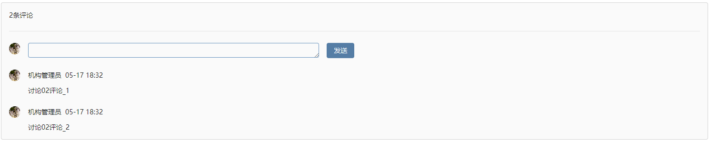

# 评论回复列表

该插件基于文本框进行增强，主要用于在回显评论时，以列表形式展现评论，并且允许添加评论。

## 页面展示



## 主要功能

**展示回复**

​	以列表形式展示所有回复。

**删除回复**    

​	可对展示出来的自己的回复进行删除处理

**新增回复**

​	可对评论进行新的回复。

## 输入参数

| 参数 | 类型   | 说明                                                         |
| ---- | ------ | ------------------------------------------------------------ |
| PID  | string | 在进行回复时，需要当前评论的主键，可配置直接值，这样在抛出新增评论事件时，就会携带上配置的值，也可以配置  %key% 形式的值，被百分号包裹的值会去上下文，视图参数，当前项数据中寻找对应的数据，并将找到的值放入data中，随新增评论事件一起抛出 |

注： 新增评论抛出事件中data的格式如下 ,其中，key表示被百分号包裹的字符串

```
{
	key:'xxx',
	value:"评论文本"
}
```

删除事件抛出的data为删除的回复的这一项数据。


## 附录

### 插件

```

```

### 样式

```

```

