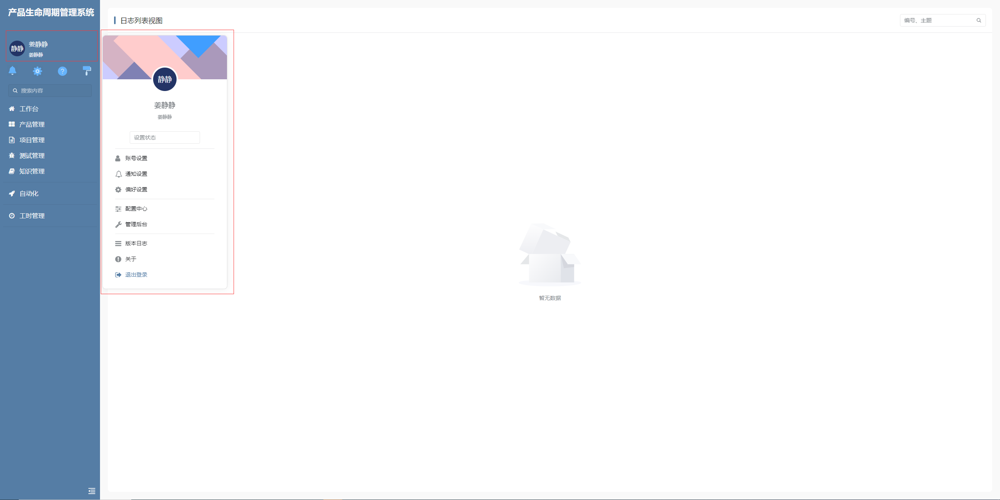

# 自定义用户信息

该插件基于用户信息组件增强，主要是实现以弹框方式打开配置的用户信息视图，解决自定义用户信息显示。**该插件隶属于自定义部件绘制插件（基于用户信息组件进行扩展）**


## 页面展示




## 功能说明

### 特有Ui样式

### 自定义用户信息

- 用户信息视图名称必须为（userinfocustomview）


## 附录

### 自定义用户信息插件

```json
[
  {
    "plugintype": "CUSTOM",
    "rtobjectrepo": "@ibiz-template-plm/custom-user-info@0.0.3-dev.8",
    "codename": "UsrPFPlugin0317929153",
    "plugintag": "CUSTOM_AUTH_USERINFO",
    "rtobjectmode": 2,
    "rtobjectname": "IBizCustomUserInfo",
    "pssyspfpluginname": "自定义用户信息"
  }
]
```
