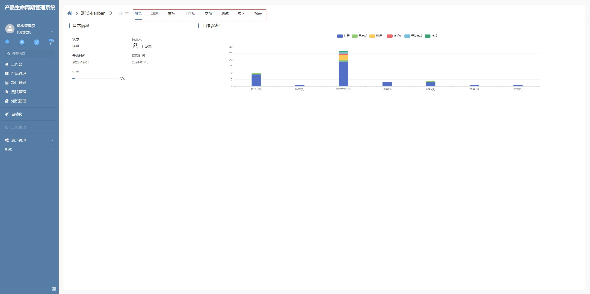
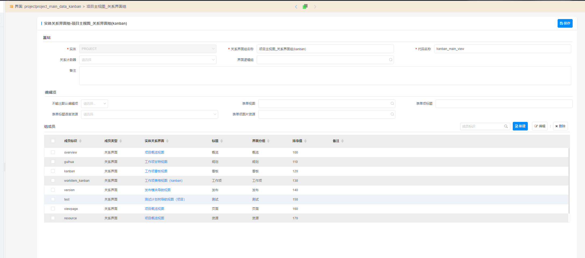

# 数据关系栏增强

该插件基于数据关系栏增强，其与默认的数据关系栏存在的区别是对关系界面组进行了二次分组，第一层导航分组为关系界面组中的界面分组项，第二层导航分组为默认的导航数据项，且选择第一层导航时默认选中第二层的第一项。**该插件基于数据关系栏部件进行的扩展**

## 页面展示



## 功能说明

- 支持切换路由时切换分页项及分页视图

## 基本使用

在具体项目中，先通过模型导入前端界面插件，然后在视图上的 drbar 部件中选择“增强导航栏”插件

它对应的关系界面组配置为



## 附录：

### 增强导航栏插件

```json
[
  {
    "plugintype": "CUSTOM",
    "rtobjectrepo": "@ibiz-template-plm/drbar-ex@0.0.2-dev.151",
    "codename": "UsrPFPlugin1226953997",
    "plugintag": "DRBAR_EX",
    "rtobjectmode": 2,
    "rtobjectname": "IBizDRBarExControl",
    "pssyspfpluginname": "增强导航栏"
  }
]
```
