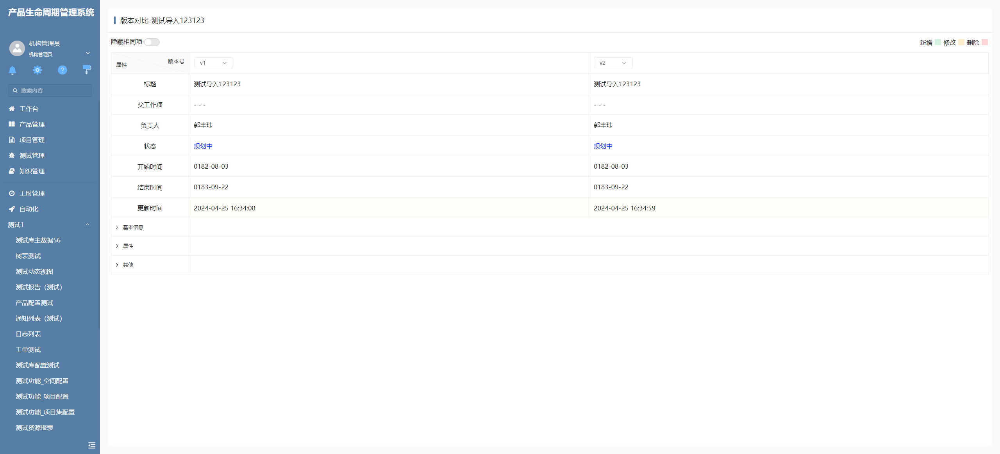

# 表单数据对比插件

该插件基于编辑表单组件增强，主要是实现数据不同版本之间对比差异。


## 页面展示




## 主要逻辑

1. 部件初始化时会请求下拉版本数据，并由表单分页模型计算出表格模型。
2. 部件请求数据，分别请求基础版本数据及对比版本数据。随后计算各属性是否修改，新增，删除生成属性差异数组。
3. 根据计算出的表格模型及属性差异数组计算出表格完全数据。
4. 根据表格完全数据去除相同数据项。
5. 新增多数据部件对比，对比方式与表单项一致。目前只有一个控制器，导致展示异常。
6. 关系界面数据对比过程：onCreated是设置存储关系界面的view,随后onDataChange触发，每触发一次会计数并计算出关系界面的对比对象，当计数值和设置存储关系界面的view的Map size相同时，表示已经全部加载完了，计算出关系界面差异值，使用已有的AllGridData数据中关系界面判断设置三种状态，再根据状态排重计算出removeSameGridData数据。（对比只是粗略对比，没有针对配置的属性进行对比）
7. 修改版本之后load，load都会进行重新计算。


## 附录

### 表单数据对比插件

```json
[
  {
    "plugintype": "EDITFORM_RENDER",
    "codename": "UsrPFPlugin0425122898",
    "plugintag": "FORM_DATA_COMPARISON",
    "pssyspfpluginname": "编辑表单数据对比"
  }
]
```
