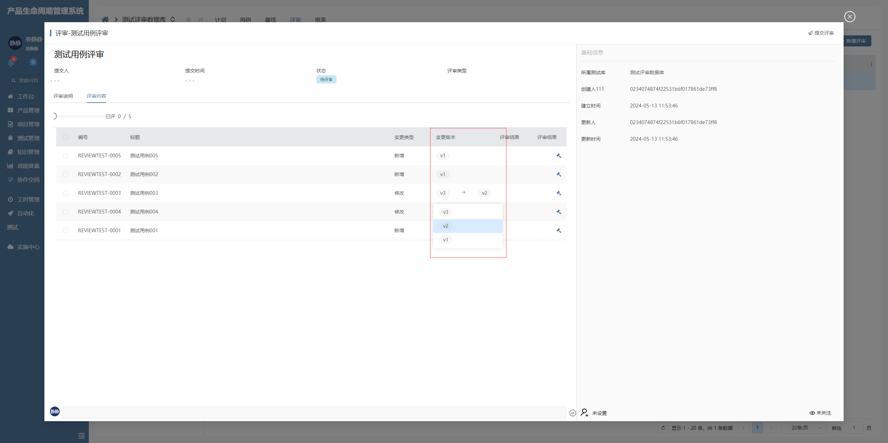

# 表格列变更版本

该插件基于表格列组件增强，主要是用于切换原版本数据用于对比。**该插件隶属于数据表格列绘制插件**


## 页面展示




## 功能说明

- 支持自填模式

- 支持自定义导航参数查询自填内容

- 支持只读模式

- 支持数据变更后触发界面行为


## 输入参数

### 编辑器参数配置

| 属性名       | 描述         | 类型                      | 默认值      |
| ------------ | ------------ | ------------------------- | ----------- |
| readonly    | 是否只读      | boolean                   | false       |

### 表格列自定义参数配置

```
SRFNAVPARAM.n_owner_id_eq=%owner_id%
```


## 附录

### 表格列变更版本插件

```json
[
  {
    "plugintype": "GRID_COLRENDER",
    "rtobjectrepo": "@ibiz-template-plm/grid-change-version-column@0.0.3-dev.146",
    "codename": "UsrPFPlugin0514100248",
    "plugintag": "COLUMN_CHANGE_VERSION",
    "rtobjectmode": 2,
    "rtobjectname": "IBizGridChangeVersionColumn",
    "pssyspfpluginname": "表格列变更版本"
  }
]
```
