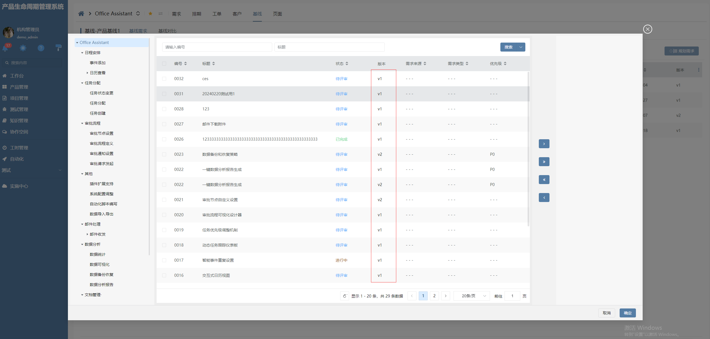

# 表格直接代码编辑列

该插件为表格列组件增强，增加了初始化脚本代码与值变更脚本代码，**该插件隶属于数据表格列绘制插件**。

## 页面展示



## 功能说明

- 初始化脚本代码：在编辑器参数中配置INITSCRIPTCODE参数，表格列初始化值执行
- 值变更脚本代码：在编辑器参数中配置CHANGESCRIPTCODE参数，表格列值变更执行
- 禁止保存：配置ENABLESAVE=false编辑器参数，表格列blur时将不会保存

## 输入参数

| 名称             | 说明           |
| ---------------- | -------------- |
| INITSCRIPTCODE   | 初始化执行脚本 |
| CHANGESCRIPTCODE | 值改变执行脚本 |
| ENABLESAVE       | 是否允许保存   |

## 附录

### 表格直接代码列插件

```json
[
  {
    "plugintype": "GRID_COLRENDER",
    "rtobjectrepo": "@ibiz-template-plm/grid-jscode-column@0.0.3-dev.100",
    "codename": "UsrPFPlugin0426736158",
    "plugintag": "JSCODE_GRID_COLUMN",
    "rtobjectmode": 2,
    "rtobjectname": "IBizGridJsCodeColumn",
    "pssyspfpluginname": "直接内容表格列"
  }
]
```
