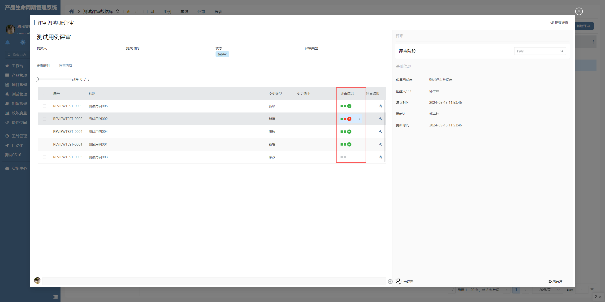

# 表格列评审结果

该插件基于表格列组件增强，主要是用于显示评审结果阶段的不同状态，它旨在提供直观且灵活的评审结果展示功能。**该插件隶属于数据表格列绘制插件**


## 页面展示




## 功能说明

### 支持评审结果UI绘制

- 根据评审结果的状态，自动绘制对应的UI元素

- 当评审最终结果参数值明确（非未定义）时，将根据评审最终结果状态值自动绘制通过或拒绝的图标

### 支持单个评审阶段的评审结果UI绘制

- 在存在评审阶段视图参数并且评审结果状态值明确（未评审）的情况下。当是否可评审明确（非可评审）时，绘制无内容（---）。当是否可评审明确（可评审）时，绘制可评审元素

- 当评审结果状态值明确（非未评审）时，根据评审结果状态绘制通过元素或拒绝元素

### 支持代码表配置

- 根据评审结果的状态，绘制元素不同的背景颜色

- 当为单个评审阶段时，将根据评审结果的状态，绘制代码表标题

### 支持数据变更后触发界面行为

- 评审结果列单元格单击执行行为后，该行为会携带当前点击行的数据


## 附录

### 表格列评审结果插件

```json
[
  {
    "plugintype": "GRID_COLRENDER",
    "rtobjectrepo": "@ibiz-template-plm/grid-review-results-column@0.0.3-dev.150",
    "codename": "UsrPFPlugin0515740591",
    "plugintag": "COLUMN_REVIEW_RESULTS",
    "rtobjectmode": 2,
    "rtobjectname": "IBizGridReviewResultsColumn",
    "pssyspfpluginname": "表格列评审结果"
  }
]

```
