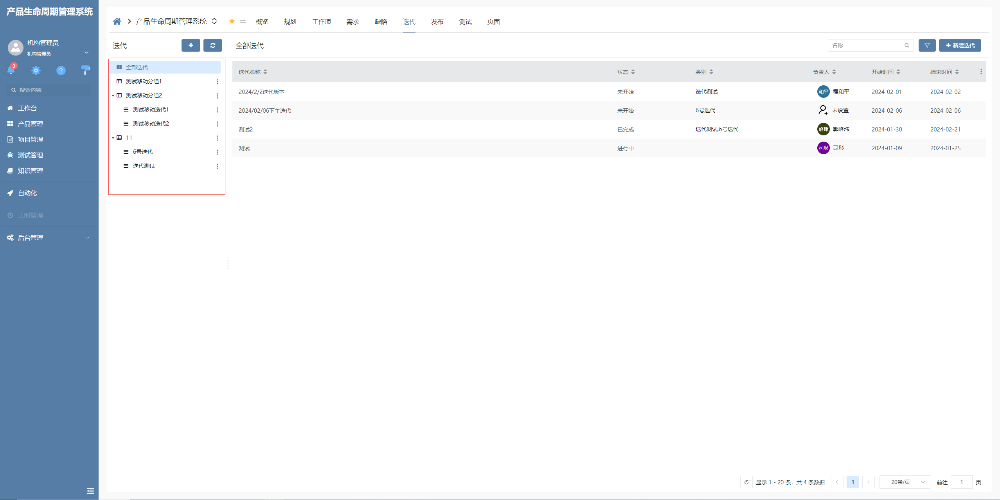

# 分组树

该插件是对树部件的增强，主要是通过界面逻辑调用插件能力实现树节点自定义增删改。隶属于**自定义部件插件（树部件）**。

## 页面展示



## 功能说明

**分组树样式：**区别于模板树样式，该插件特有的样式

**区分节点分组及节点项：**该插件适配界面逻辑，可以通过界面逻辑调用控制器方法，实现分组与节点的操作

**新建树节点：**通过界面逻辑调用，type 区分新建节点类型，defaultValue 为向后台请求时携带参数

**编辑树节点：**通过界面逻辑调用，nodeKey 为当前操作节点的唯一标识，defaultValue 为向后台请求时携带参数

**删除树节点：**通过界面逻辑调用，nodeKey 为当前操作节点的唯一标识

**树节点拖拽后默认填充节点数据：**通过在节点关系上配置处理参数的方式指定下级节点填充值，格式为[下级节点要填充的数据字段名称]=[上级节点的数据字段名称]

## 输入参数

### 新建树节点 newTreeNode

| 属性名       | 描述                                                  | 类型    | 默认值 |
| ------------ | ----------------------------------------------------- | ------- | ------ |
| type         | 区分新增树节点类型为分组或是分组项,根据树节点标识配置 | string  | —      |
| defaultValue | 新增节点时默认携带参数                                | IParams | -      |

### 编辑树节点 updateTreeNode

| 属性名       | 描述               | 类型    | 默认值 |
| ------------ | ------------------ | ------- | ------ |
| nodeKey      | 树节点唯一标识     | string  | —      |
| defaultValue | 编辑节点时携带参数 | IParams | —      |

### 删除树节点 removeTreeNode

| 属性名  | 描述              | 类型   | 默认值 |
| ------- | ----------------- | ------ | ------ |
| nodeKey | 树节点唯一标识 id | string | —      |

### 树节点拖拽后默认填充节点数据

通过在节点关系上配置处理参数的方式指定下级节点填充值，格式为[下级节点要填充的数据字段名称]=[上级节点的数据字段名称]

如: `section_id=id`

section_id :为下级节点要填充的数据字段名称
id :为上级节点的数据字段名称

## 事件

| 事件名         | 说明           | 参数                                                   |
| -------------- | -------------- | ------------------------------------------------------ |
| newTreeNode    | 新建树节点     | 2 个参数，分别是当前树节点标识, 当前新增节点时携带参数 |
| updateTreeNode | 编辑指定树节点 | 2 个参数，分别是当前树节点 id, 当前节点编辑时携带参数  |
| removeTreeNode | 删除指定树节点 | 1 个参数，当前树节点 id                                |

## 基本使用

在具体项目中，先通过模型导入分组树插件，然后在具体的树部件内选择对应的前端应用插件。

配置树部件时注意树节点配置标识，需要区分分组节点或者是分组项节点。

## 附录：

### 树部件插件

```json
[
  {
    "plugintype": "TREE_RENDER",
    "rtobjectrepo": "@ibiz-template-plm/group-tree@0.0.2-dev.151",
    "codename": "UsrPFPlugin1226747395",
    "plugintag": "GROUP_TREE",
    "rtobjectmode": 2,
    "rtobjectname": "IBizGroupTreeControl",
    "pssyspfpluginname": "分组树"
  }
]
```
