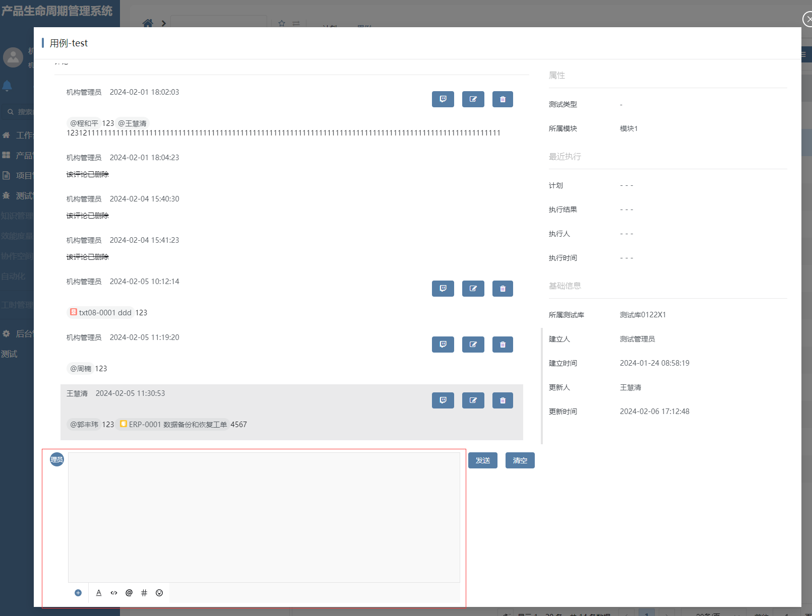
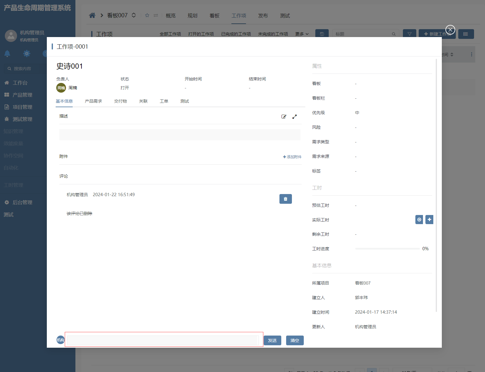
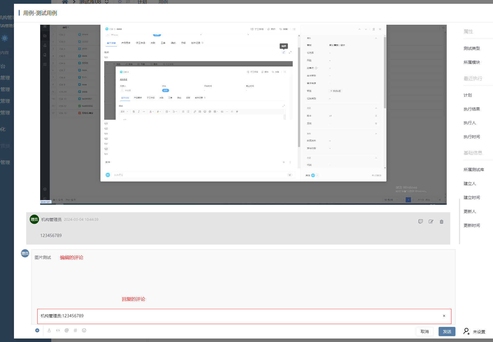
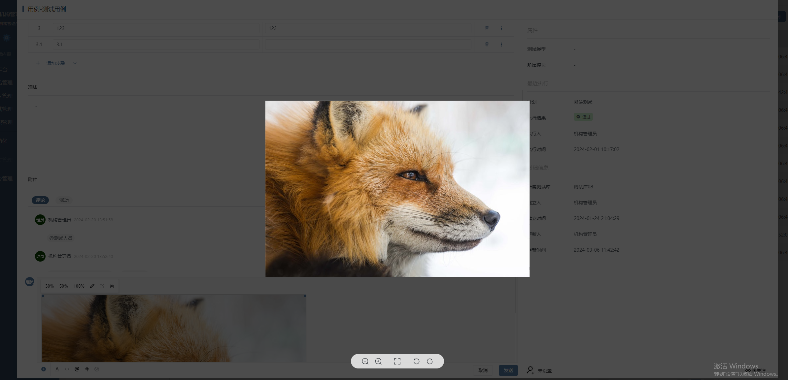
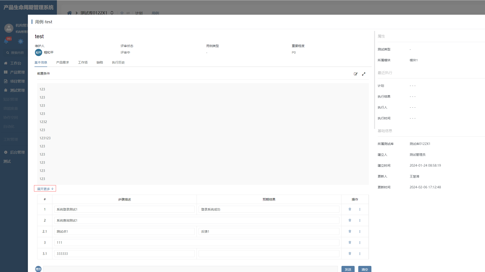
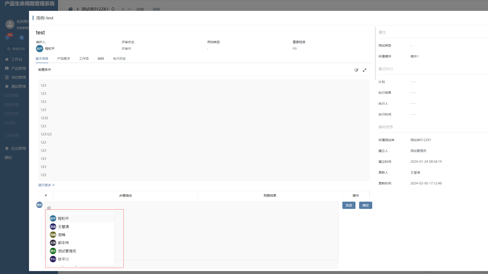
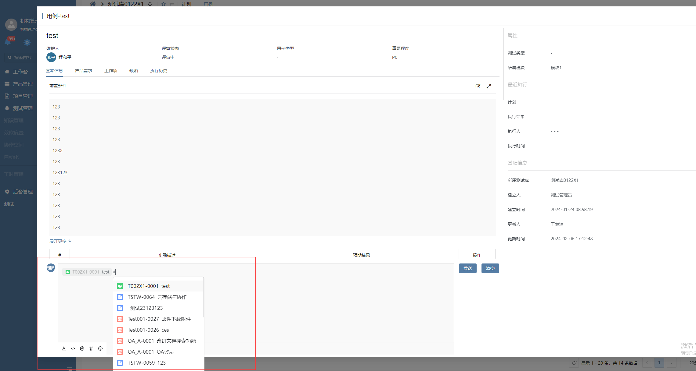

# 评论富文本

评论富文本插件基于 html 富文本增强，主要功能有折叠展开、@提及用户、#提及工作项、上传附件、代码段、页面等，**该插件隶属于编辑器自定义绘制插件（基于 HTML 编辑器进行的扩展）**。



## 功能说明

### 折叠功能

- 默认状态下，隐藏富文本工具栏，且高度设置为编辑器参数 MINHEIGHT 对应的值。

- 当输入框 focus 时，展开富文本，显示工具栏，高度为编辑器参数 MAXHEIGHT 对应的值。

- 当输入框 blur 且输入框无值时，再次折叠输入框。



### 编辑、回复评论功能

- 插件控制器暴露 setReply 方法，通过该方法设置回复评论数据

- 插件控制器暴露 setValue 方法，通过该方法设置富文本内容

- 插件控制器暴露 removeReply、clear 方法，对应清空回复与清空所有

  

### 图片预览功能

- 点击图片将打开图片的预览弹框，同时支持放大缩小、旋转等预览功能

  

### 默认模式

- 识别 MAXHEIGHT 参数，内容高度超过它时出现展开更多（收起更多按钮）按钮



### 提及用户功能

| 属性名       | 描述                             | 类型       | 默认值                                 |
| ------------ | -------------------------------- | ---------- | -------------------------------------- |
| USERURL      | 请求用户列表 url                 | string     |                                        |
| USERFIELDMAP | 用户属性映射表，用于转换用户数据 | Object     | {id: 'id', name:'name'}                |
| USERMETHOD   | 请求用户数据方法                 | post / get | post                                   |
| USERSCRIPT   | 选中提及用户时编辑器抛出的值格式 | string     | @{userid=${data.id},name=${data.name}} |
| USERINSCRIPT | 解析提及用户数据格式脚本         | string     |                                        |

- 输入@或点击@菜单时弹出用户列表（通过添加注册 mention 节点支持，用户列表数据根据 USERURL、USERFIELDMAP、USERMETHOD 支持）
- 支持 ac 过滤
- 支持上下选择，回车选中
- 支持自定义数据格式（选中数据后根据 USERSCRIPT 来解析数据并返回最终数据格式）
- 支持编辑评论时回显（根据 USERINSCRIPT 参数来对数据进行逆解析，转换为富文本能识别的格式并绘制）



### 提及工作项

| 属性名        | 描述                                 | 类型       | 默认值                                                       |
| ------------- | ------------------------------------ | ---------- | ------------------------------------------------------------ |
| QUOTEURL      | 请求工作项列表 url                   | string     |                                                              |
| QUOTEFIELDMAP | 工作项属性映射表，用于转换工作项数据 | Object     | {id: 'id', name:'name'}                                      |
| QUOTEMETHOD   | 请求用户数据方法                     | post / get | post                                                         |
| QUOTEPARAMS   | 请求参数                             | Object     |                                                              |
| QUOTESCRIPT   | 选中提及工作项时编辑器抛出的值格式   | string     | \#{id=${data.id},name=${data.name},identifier=${data.identifier},icon=${data.icon}} |
| QUOTEINSCRIPT | 解析提及工作项数据格式脚本           | string     |                                                              |

- 输入#或点击#菜单时弹出用户列表（通过添加注册 marker 节点支持，工作项列表数据根据 QUOTEURL、QUOTEFIELDMAP、QUOTEMETHOD、QUOTEPARAMS 支持）
- 支持 ac 过滤
- 支持上下选择，回车选中
- 支持自定义数据格式（选中数据后根据 QUOTESCRIPT 来解析数据并返回最终数据格式）
- 支持编辑评论时回显（根据 QUOTEINSCRIPT 参数来对数据进行逆解析，转换为富文本能识别的格式并绘制）



### 上传文件功能

暂未支持

### 上传代码段

暂未支持

### 上传页面

暂未支持

### AI询问

插件支持AI询问功能，在配置自填模式，且自填模式为AI聊天模式的情况下，评论工具栏会出现AI的图标，点击IA图标，会弹出AI聊天模态，可以与AI进行对话，同时可根据对话情况选择是否将AI回答内容回填到评论框中

### 协同编辑
插件通过集成yjs和slate-yjs支持协同编辑，需配置编辑器参数ENABLEREALTIME=true，以启用协同编辑功能。

[yjs参考资料](https://blog.csdn.net/weixin_47746452/article/details/135079472)

[slate-yjs文档](https://docs.slate-yjs.dev/)

[slate-yjs演示地址](https://slate-yjs.dev/remote-cursors-overlay)

该插件关于协同编辑的逻辑及组件都放在**slate-yjs**目录下：

1. 创建SlateYjs实列以便管理协同编辑功能

```json
// enableRealtime 为boolean类型，控制是否启用协同编辑
const slateYjs: SlateYjs = new SlateYjs(enableRealtime);
```

2. 如果需要显示协同编辑用户光标信息，必须使用**CursorOverlay**组件将wangEditor包裹起来

```json
  <CursorOverlay
    slateYjs={slateYjs}
  >
    <Toolbar
      ...
      ...
    />
    <Editor
      ...
      ...
    />
  </CursorOverlay>
```

3. 调用SlateYjs实例的initYjs方法将协同编辑所需的参数传递进去

```json
  const isCreate = props.data.srfuf === Srfuf.CREATE;
  slateYjs.initYjs({
    roomname: isCreate ? 'draft' : props.data.srfkey,
    editor: editorRef.value,
    context: c.context,
    params: c.params,
    htmlRef: htmlRef.value,
  });
```

#### 初始化markOpenData服务

在富文本编辑器初始化时，如果富文本启用协同编辑，则初始化数据服务，以便后续协同编辑时的数据同步：

1. 在部件数据初始化加载成功后，发送信息类型**VIEW**，并监听当前数据

2. 在部件数据保存成功后，发送信息类型**UPDATE**

3. 在视图关闭时，发送信息类型**CLOSE**

#### 数据同步

Slate框架有一个**apply**方法，在编辑器中的任意操作都会触发**apply**，因此只需要重写**apply**，在启用协同编辑的时候将数据通过markOpenData服务发送出去，其他用户接到消息之后将接到的数据传入**原本的apply**（防止死循环）中，交由Wangeditor自己将数据添加进来

#### 光标信息处理

在协同编辑时，我们想要知道其他用户的光标在当前编辑器上的位置，需在当前编辑器上其他用户的光标位置处插入一个用户标记来展示，因此我们需要在发送和接收消息的时候对光标数据进行处理，让我们能够得知其他用户的光标在当前编辑器的位置

​    光标在每一行的文本偏移量在每个用户的编辑器上都是一致的，不会因为插入了用户标记导致位置不同，所以计算光标位置时我们使用光标在这行上的文本偏移量为基准来计算

根据位置计算偏移量：**calcOffsetByPoint**

根据偏移量计算位置：**calcPointByOffset**

**注意：在计算时我们将空字符串的偏移量记为1，否则在一个图片节点前后都是一个空文本节点时导致数据解析出来的位置不对**

#### 选区颜色

为了和用户操作设置的背景色做区别，通过WangEditor给的接口重写了**renderStyle**方法

## 输入参数

| 属性名         | 描述                                               | 类型             | 默认值  |
| -------------- | -------------------------------------------------- | ---------------- | ------- |
| MINHEIGHT      | 折叠时的输入框高度                                 | number           | 48      |
| MAXHEIGHT      | 展开时的富文本高度                                 | number           | 315     |
| MODE           | 模式，default 时为富文本样式，comment 时为评论模式 | comment/default  | comment |
| REPLYSCRIPT    | 回复脚本，回复的项绘制器脚本代码                   | string           |         |
| RENDERMODE     | 支持段落化json，绘制模式                           | HTML/JSON        | HTML    |
| SAVEINTERVAL   | 支持段落化json，保存间隔                           | number           | 3000    |
| EMITMODE       | 支持段落化json，抛值模式                           | BUTTON/AUTOMATIC | BUTTON  |
| ENABLEREALTIME | 实时编辑（协同编辑）                               | boolean          | false   |

## 基本使用

在具体项目中，先通过模型导入前端界面插件和编辑器插件，然后在具体的视图配置动态文本，然后将其编辑器类型改为 HTML 编辑框，编辑器类型选择“HTML（评论）”

## 附录：

### 资料

[Slate中文文档](https://rain120.github.io/athena/zh/slate/Summary.html#%E5%AE%9E%E6%88%98%E6%BC%94%E7%BB%83)

[WangEditor](https://www.wangeditor.com/)

### 编辑器插件

```json
[
  {
    "codename": "COMMENT_PROJECT",
    "pssyspfpluginid": "UsrPFPlugin0104147761",
    "repdefault": 0,
    "validflag": 1,
    "pssyseditorstylename": "HTML（评论）（项目）",
    "ctrlparams": "USERURL=`projects/${context.project}/project_members/fetchdefault`\nSRFNAVPARAM.n_department_id_eq=%srforgsectorid%\nUSERFIELDMAP={\"id\":\"user_id\",\"name\":\"name\"}",
    "pseditortypeid": "HTMLEDITOR"
  }
]
```

### 前端界面插件

```
[
  {
    "plugintype": "EDITOR_CUSTOMSTYLE",
    "rtobjectrepo": "@ibiz-template-plm/html-comment@0.0.3-dev.131",
    "codename": "UsrPFPlugin0104147761",
    "plugintag": "COMMENT",
    "rtobjectmode": 2,
    "rtobjectname": "IBizHtmlComment",
    "pssyspfpluginname": "HTML（评论）"
  }
]
```