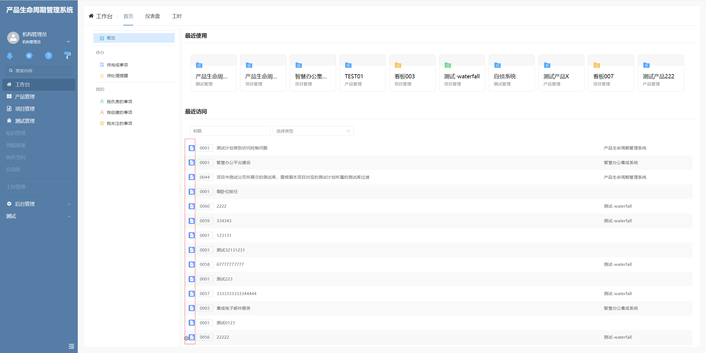

# 表格列图标

该插件基于表格列增强，主要功能为当前在表格列中只显示图标，不显示文字。**该插件隶属于数据表格列绘制插件（基于表格列进行扩展）**

## 页面展示



## 功能说明

- 当前表格列只显示代码表图标，所有文字不显示

## 附录

### 表格列图标插件

```json
[
  {
    "plugintype": "GRID_COLRENDER",
    "rtobjectrepo": "@ibiz-template-plm/icon-grid-column@0.0.2-dev.151",
    "codename": "UsrPFPlugin0109916671",
    "plugintag": "ICON_GRIDCOLUMN",
    "rtobjectmode": 2,
    "rtobjectname": "IBizIconGridColumn",
    "pssyspfpluginname": "表格列图标"
  }
]
```
