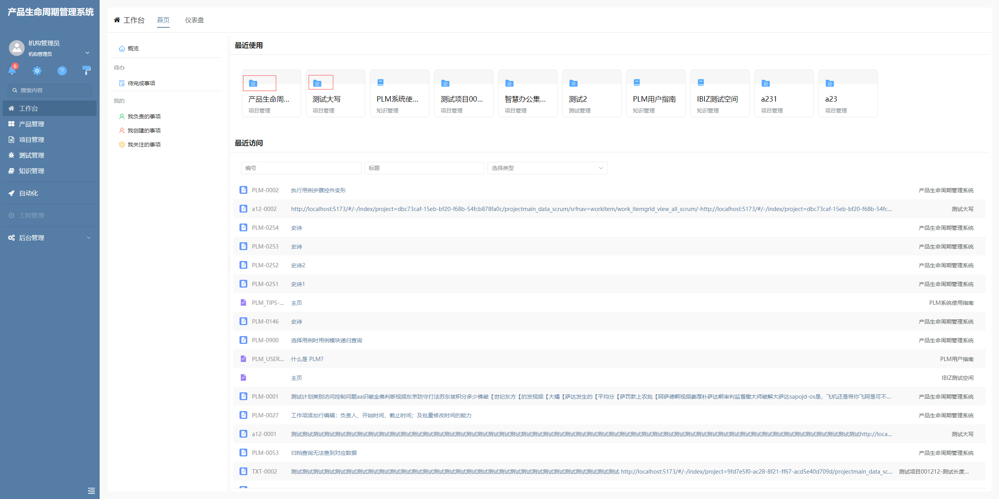
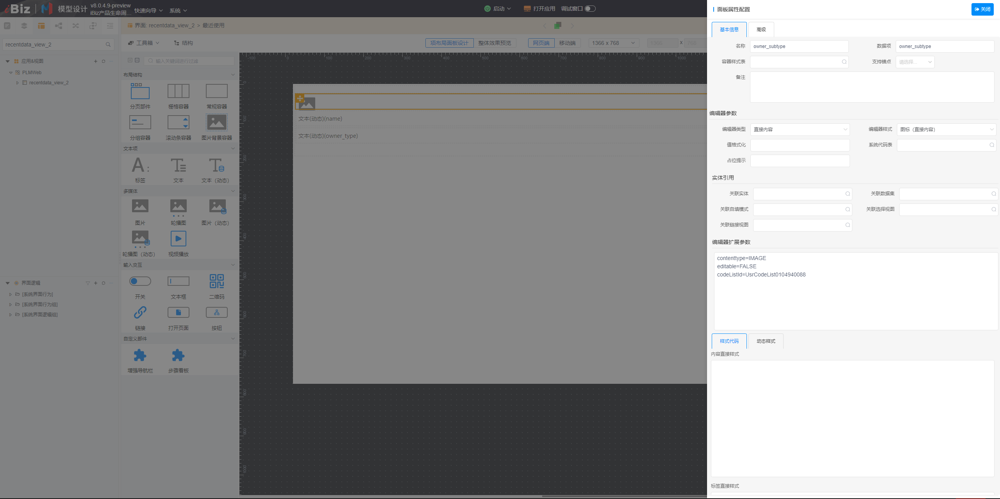

# 直接内容图标

该插件基于直接内容增强，主要是支持直接内容编辑器识别代码表图标功能，可以根据代码项值显示图标。**该插件隶属于编辑器自定义绘制插件（基于直接内容编辑器进行的扩展）**

## 页面展示



## 功能说明

- 该插件只显示代码表图标，所有文字不显示

## 输入参数

| 属性名      | 描述             | 类型    | 默认值 |
| ----------- | ---------------- | ------- | ------ |
| contenttype | 内容类型         | string  | —      |
| editable    | 是否允许编辑     | boolean | —      |
| codeListId  | 代码表的代码标识 | string  | —      |

### 示例配置

```
contenttype=IMAGE
editable=FALSE
codeListId=UsrCodeList0104940088
```



## 基本使用

在具体项目中，先通过模型导入前端界面插件和编辑器插件，然后在具体的面板中配置动态图片，然后将其编辑器类型改为直接内容，编辑器样式选择"图标（直接内容）"。最后将需要的参数配置在直接内容的编辑器参数上即可使用。

## 附录

### 编辑器插件

```json
[
  {
    "codename": "ICON_RAWITEM",
    "pssyspfpluginid": "UsrPFPlugin0108590874",
    "repdefault": 0,
    "validflag": 1,
    "pssyseditorstylename": "直接内容图标",
    "pseditortypeid": "RAW"
  }
]
```

### 前端界面插件

```json
[
  {
    "plugintype": "EDITOR_CUSTOMSTYLE",
    "rtobjectrepo": "@ibiz-template-plm/icon-rawitem@0.0.2-dev.3",
    "codename": "UsrPFPlugin0108590874",
    "plugintag": "ICON_RAWITEM",
    "rtobjectmode": 2,
    "rtobjectname": "IBizIconRawItem",
    "pssyspfpluginname": "图标（直接内容）"
  }
]
```
