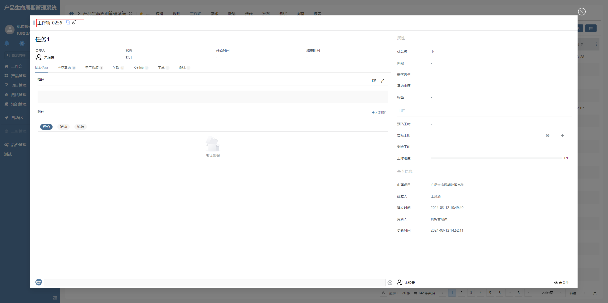

# 编号标题栏

该插件基于页面标题增强，主要是用于模态弹框标题，支持标题的复制及当前路由路径的复制。**该插件隶属于自定义部件绘制插件（基于页面标题进行扩展）**


## 页面展示




## 功能说明

- 支持视图标题复制

- 支持路由路径复制

- 支持模态标题显示工作项编号


## 附录

### 编号标题栏插件

```json
[
  {
    "plugintype": "CUSTOM",
    "rtobjectrepo": "@ibiz-template-plm/identifier-title@0.0.2-dev.151",
    "codename": "UsrPFPlugin0117840415",
    "plugintag": "IDENTIFIER_TITLE",
    "rtobjectmode": 2,
    "rtobjectname": "IBizIdentifierTitle",
    "pssyspfpluginname": "编号标题栏"
  }
]
```
