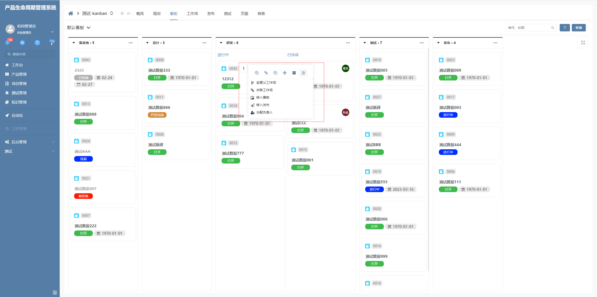
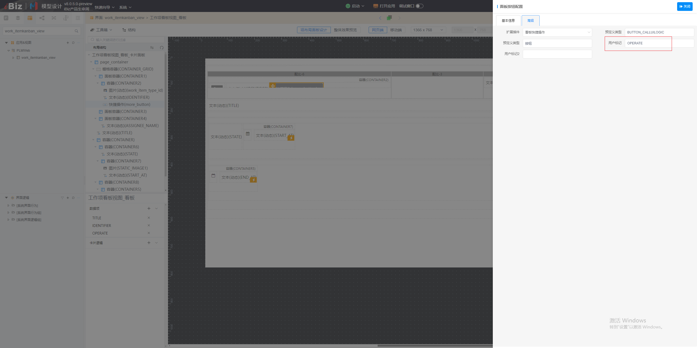
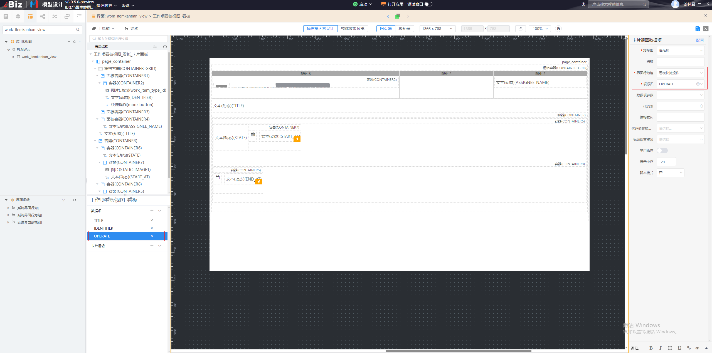

# 看板快捷操作

该插件基于面板项按钮增强，主要是用于以popover弹窗形式展示界面行为组。**该插件隶属于自定义部件绘制插件（基于面板项按钮进行的扩展）**


## 界面展示




## 功能说明

- 支持展示看板上配置的界面行为组中每项界面行为

- 关键级别界面行为为顶部仅图标展示

- 一般级别行为为下方图标和文字组合展示


## 输入参数

| 参数    | 类型   | 默认值  | 说明                     |
| ------- | ------ | ------- | ------------------------ |
| userTag | string | OPERATE | 指定配置的界面行为组标识 |


## 平台配置展示






## 附录

### 看板快捷操作插件

```json
[
  {
    "plugintype": "CUSTOM",
    "rtobjectrepo": "@ibiz-template-plm/kanban-operate@0.0.2-dev.112",
    "codename": "UsrPFPlugin0226588993",
    "plugintag": "KANBAN_OPERATE",
    "rtobjectmode": 2,
    "rtobjectname": "IBizKanbanOperate",
    "pssyspfpluginname": "看板快捷操作"
  }
]
```

