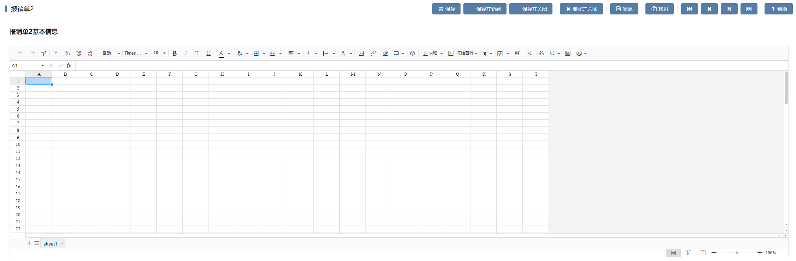

# luckysheet编辑插件

luckysheet编辑插件基于多行输入框增强，扩展支持在线excel功能。

## 页面展示



## 基本使用

在具体项目中，先通过模型导入编辑器插件、再导入编辑器样式，最后在具体的表单中选择对应的编辑器样式即可复用，其中编辑器插件和编辑器样式具体数据参见附录，相关示例如下。

## 附录

### 多行输入框增强插件

```json
[
  {
    "plugintype": "EDITOR_CUSTOMSTYLE",
    "rtobjectrepo": "@ibiz-template-plm/lucky-sheet-editor@0.0.3-dev.47",
    "codename": "UsrPFPlugin0318918258",
    "plugintag": "LUCKYSHEET",
    "rtobjectmode": 2,
    "rtobjectname": "IBizLuckySheet",
    "pssyspfpluginname": "LuckySheet编辑"
  }
]
```

### 编辑器样式：

```json
[
  {
    "codename": "LUCKYSHEET",
    "pssyspfpluginid": "UsrPFPlugin0318918258",
    "repdefault": 0,
    "validflag": 1,
    "pssyseditorstylename": "LuckySheet编辑样式",
    "pseditortypeid": "TEXTAREA"
  }
]
```