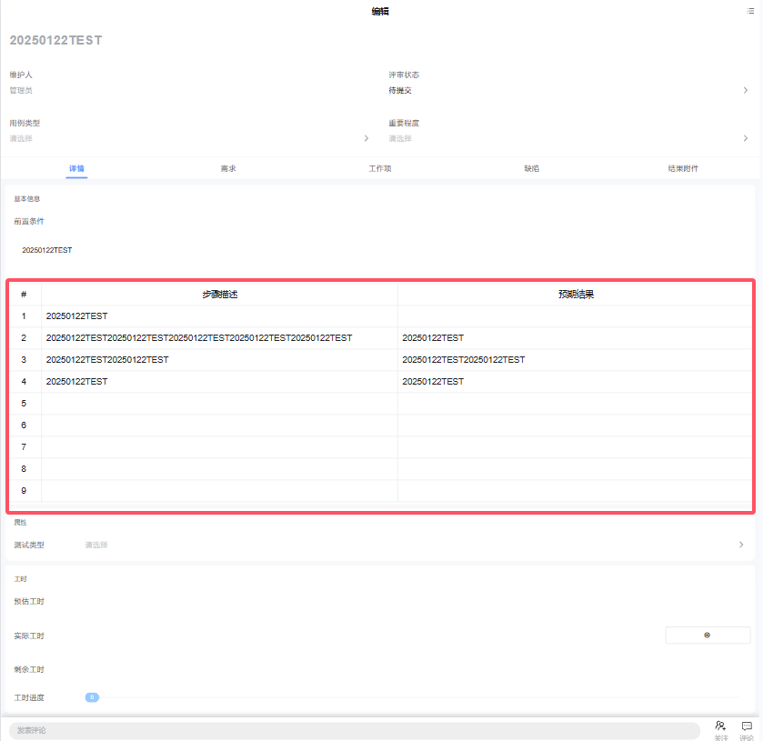

# 移动端用例步骤重复器

该插件基于移动端表单重复器增强，主要是新增了支持分组、排序、复制、新建默认值、动态逻辑等功能。**该插件隶属于表单自定义控件绘制插件（基于表单重复器进行扩展）**


## 页面展示




## 功能说明

### 分组显示

移动端用例步骤没有编辑能力，只有显示功能，在pc端编辑用例步骤后在移动端显示。


##  输入参数

| 属性名      | 描述                                                         | 类型   | 默认值   |
| ----------- | ------------------------------------------------------------ | ------ | -------- |
| groupField  | 判断数据是否为分组数据的标识属性                             | string | is_group |
| parentField | 父分组标识属性，当数据存在该属性对应的值，即该数据为分组下步骤数据 | string | group_id |
| entityKey   | 实体主键标识属性，即数据的主键                               | string | id       |


## 基本使用

在具体项目中，先通过模型导入前端界面插件，然后在具体的移动表单中添加一个重复器表格，扩展插件选择移动端用例步骤。


## 附录：

### 用例步骤重复器插件

```json
[
  {
    "plugintype": "FORM_USERCONTROL",
    "rtobjectrepo": "@ibiz-template-plmmob/mob-case-steps@0.0.3-alpha.57",
    "codename": "UsrPFPlugin1016303900",
    "plugintag": "MOB_CASE_STEPS",
    "rtobjectmode": 2,
    "rtobjectname": "IBizMobCaseSteps",
    "pssyspfpluginname": "移动端用例步骤"
  }
]
```
