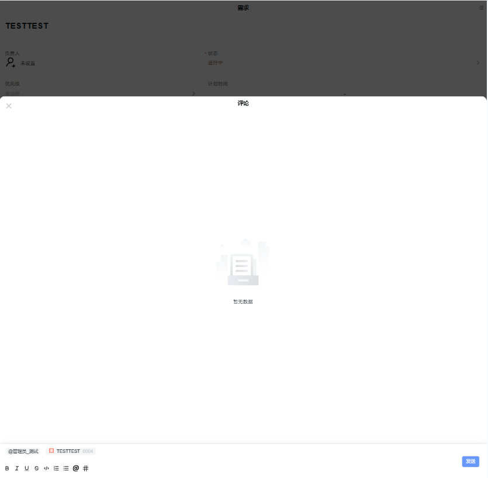
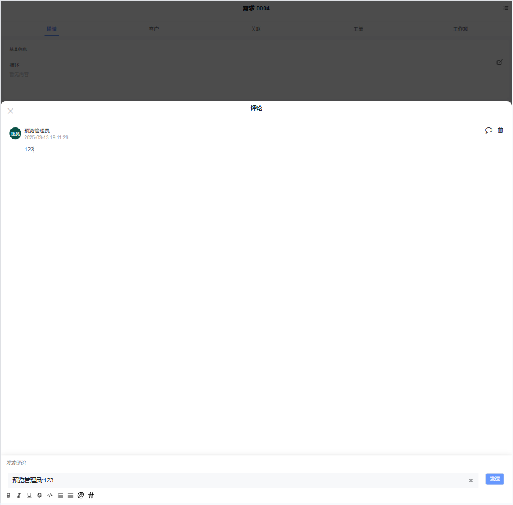
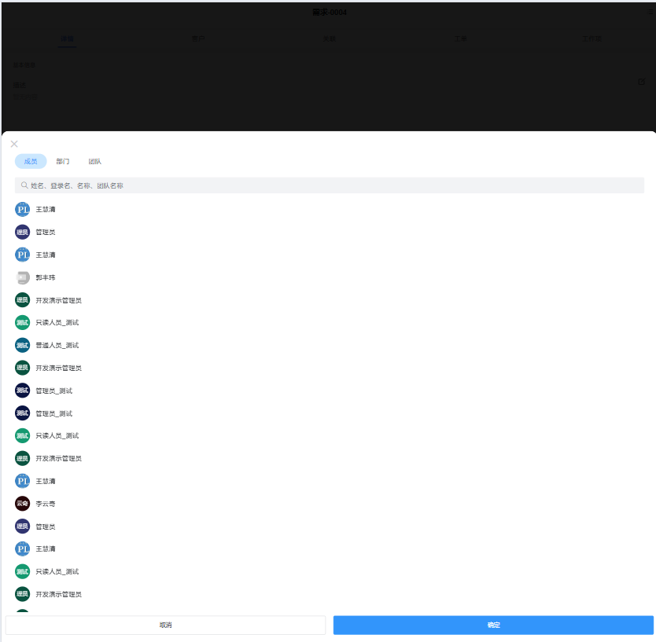

# 移动端评论富文本

移动端评论富文本插件基于移动端html 富文本增强，主要功能有折叠展开、@提及用户、#提及工作项，**该插件隶属于编辑器自定义绘制插件（基于 移动端HTML 编辑器进行的扩展）**。



## 功能说明

### 回复评论功能

- 插件控制器暴露 setReply 方法，通过该方法设置回复评论数据

- 插件控制器暴露 removeReply 方法，清空回复

  

### 提及用户功能

- 输入@或点击@菜单时弹出用户列表视图（通过配置视图逻辑配置打开视图，标识为MENTION）



### 提及工作项

- 输入#或点击#菜单时弹出历史信息列表视图（通过配置视图逻辑配置打开视图，标识为MARKER）


## 输入参数

| 属性名         | 描述                                               | 类型             | 默认值  |
| -------------- | -------------------------------------------------- | ---------------- | ------- |
| SHOWCOLLAPSE  | 是否显示伸缩按钮       | boolean        | true   |
| SHOWTOOLBAR   | 是否显示工具栏         | boolean        | true   |
| IMAGEMODE     | 上传图片格式           | base64 \| file | file   |
| MODULES       | quill的工具栏配置      | Object         | ——     |
| REPLYSCRIPT   | 绘制回复文本的脚本代码 | string         | ——     |
| DEFAULTHEIGHT | 输入框高度             | number         | 200    |
| AUTOFOCUS     | 是否自动聚焦           | boolean        | false  |

## 基本使用

在具体项目中，先通过模型导入前端界面插件和编辑器插件，然后在具体的视图配置动态文本，然后将其编辑器类型改为 HTML 编辑框，编辑器类型选择“移动端HTML（评论）”

### 编辑器插件

```json
[
  {
    "codename": "MOB_COMMENT_ITEM",
    "pssyspfpluginid": "UsrPFPlugin1025869848",
    "memo": "SCRIPTCODE=data.content?.replace(/@{[^,]*,\"name\":\"(.*?)\"}/g,\"<span class='comment-tag'>@$1</span>\").replace(/@{[^,]*,name=(.*?)}/g,\"<span class='comment-tag'>@$1</span>\").replace(/#{\"id\":\"(.+?)\",\"name\":\"(.+?)\",\"identifier\":\"(.+?)\",\"icon\":\"((.|[\\\\t\\\\r\\\\f\\\\n\\\\s])+?)\"}/g, \"<span class='comment-tag'>$4 $3 $2</span>\").replace(/#{id=(.+?),name=(.+?),identifier=(.+?),icon=((.|[\\\\t\\\\r\\\\f\\\\n\\\\s])+?)}/g, \"<span class='comment-tag'>$4 $3 $2</span>\").replaceAll(/\\\\{\\\\\"\\\\emoji\\\\\":\\\\\"(.+?)\\\\\"\\\\}/g,(x, emoji) => {const tempVal = decodeURIComponent(atob(emoji)); return `<span class=\"emoji-tag\">${tempVal}</span>`})",
    "repdefault": 0,
    "validflag": 1,
    "pssyseditorstylename": "移动端评论列表项",
    "ctrlparams": "SCRIPTCODE=data.content?.replace(/@{[^,]*,\\\"name\\\":\\\"(.*?)\\\"}/g,\\\"<span class='comment-tag'>@$1</span>\\\").replace(/@{[^,]*,name=(.*?)}/g,\\\"<span class='comment-tag'>@$1</span>\\\").replaceAll(/\\\\#\\\\{(\\\\\\\".+?\\\\\\\":\\\\\\\".+?\\\\\\\")(,\\\\\\\"icon\\\\\\\":\\\\\\\"((.|[\\\\t\\\\r\\\\f\\\\n\\\\s])+?)\\\\\\\")*\\\\}/g, (x, value, icon) => {const item = JSON.parse(\\\"{\\\" + value + \\\"}\\\"); if (icon) { icon = icon.slice(8).slice(1, -1).trim(); } return controller.parseCommentTag({icon, ...item});}).replaceAll(/\\\\{\\\\\\\"\\\\emoji\\\\\\\":\\\\\\\"(.+?)\\\\\\\"\\\\}/g,(x, emoji) => {const tempVal = decodeURIComponent(atob(emoji)); return `<span class=\\\"emoji-tag\\\">${tempVal}</span>`})",
    "pseditortypeid": "RAW"
  }
]
```

### 前端界面插件

```
[
  {
    "plugintype": "EDITOR_CUSTOMSTYLE",
    "rtobjectrepo": "@ibiz-template-plmmob/mob-html-comment@0.0.3-alpha.197",
    "codename": "UsrPFPlugin1016412762",
    "plugintag": "MOBCOMMENT",
    "rtobjectmode": 2,
    "rtobjectname": "IBizMobHtmlComment",
    "pssyspfpluginname": "移动端评论框"
  }
]
```