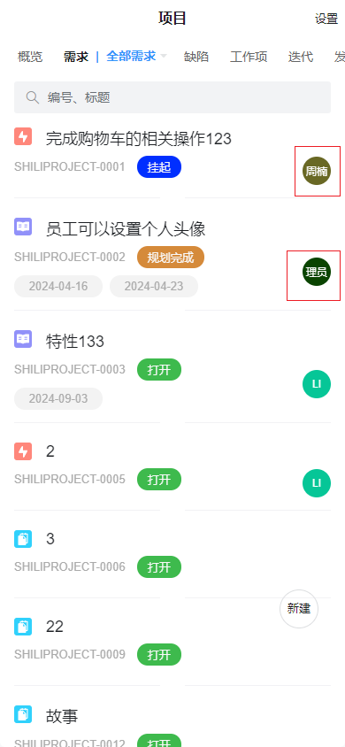

# 人员信息(移动端)

该插件基于标签增强，主要是将人员名称以图标的形式展示，并根据不同的人员名称计算为不同的图标背景颜色。**该插件隶属于编辑器自定义绘制插件（基于标签进行扩展）**


## 页面展示




## 功能说明

- 人员名称保留两个字符，并以图标的方式展示

- 根据不同的名称计算出不同的背景颜色


## 附录

### 人员信息插件

```json

```

### 编辑器样式

```json

```
